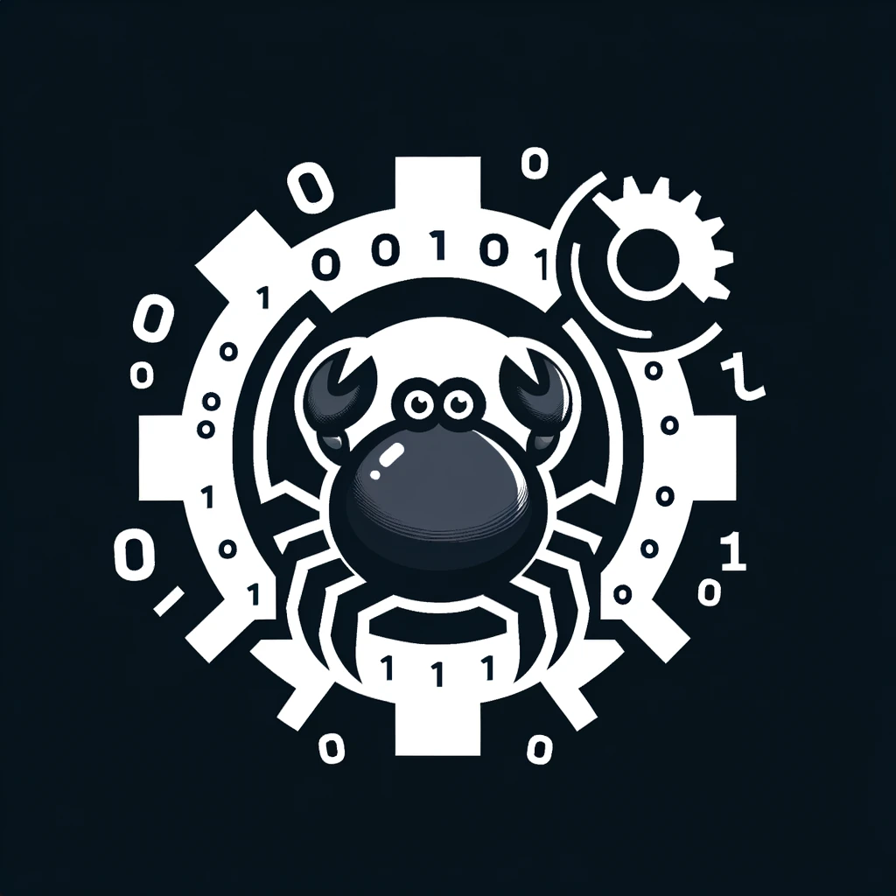

# RushToLight: Rewriting Huawei LiteOS with Rust

Project Introduction: Rust is a safe and high-performance language. Our team plans to rewrite the embedded operating system Huawei LiteOS using Rust to improve the security of embedded devices.

**Team Name:** RushToLight

**Team Members:** Ji Zizhuo, Ou Jiabin, Wu Yuchong, Shu Jiahao

**Keywords:** Rust, Embedded Operating System, LiteOS, Huawei, ~~Leading the Way~~

**Other Language Versions:  [中文](README.md), [English](README_english.md).**
