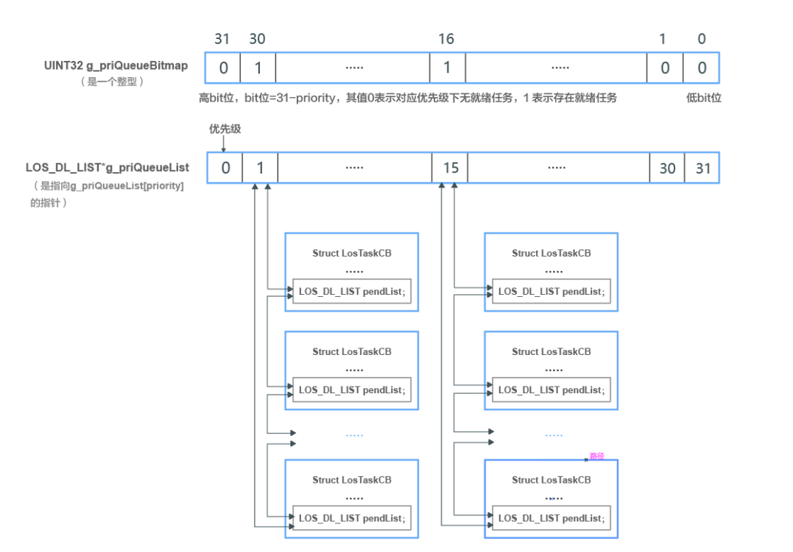
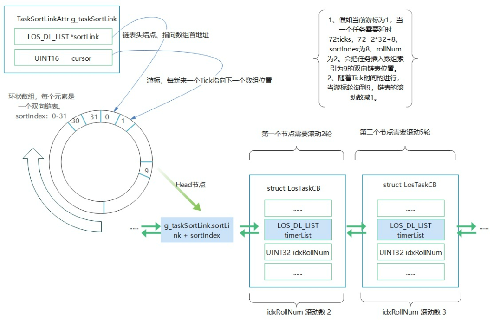
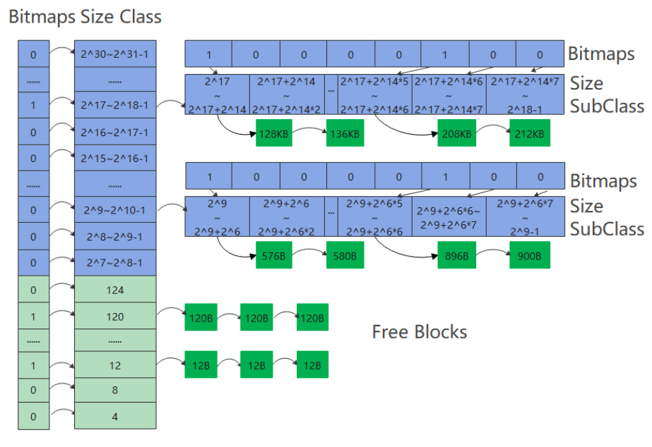
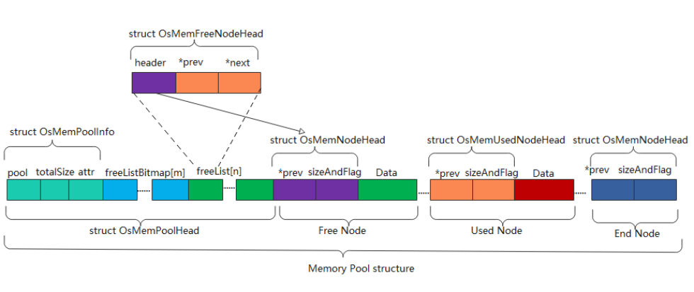
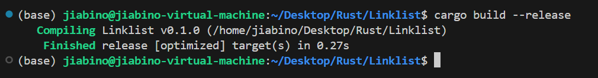
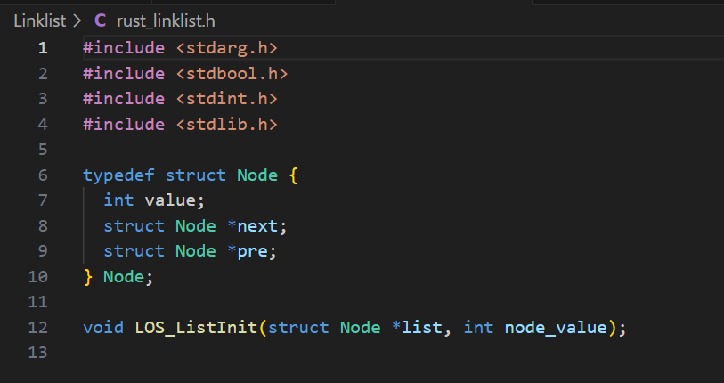
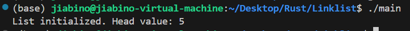
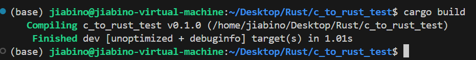
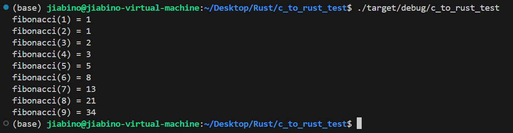

# 使用Rust语言对LiteOS核心代码代码改写可行性报告
### 觉悟OS小组(组长：舒佳豪 组员：姬子琢 吴宇翀 区家彬)
<!-- /vscode-markdown-toc -->
## 目录
- 1. [摘要](#摘要)

- 2. [Rust特性分析及改写模块分析](#Rust特性分析及改写模块分析)
   - 2.1. [Rust特性分析](#Rust特性分析)
     - 2.1.1. [初步分析](#初步分析)
     - 2.1.2. [components/fs](#components/fs)
     - 2.1.3. [components/net](#components/net)
     - 2.1.4. [详细分析](#详细分析)
   - 2.2. [Rust改写各部分可行性分析](#Rust改写各部分可行性分析)

- 3. [liteOS-m内核分析](#liteOS-m内核分析)
   - 3.1. [重要的数据结构](#重要的数据结构)
     - 3.1.1. [双向链表```LOS_DL_LIST```](#双向链表```LOS_DL_LIST```)
     - 3.1.2. [任务就绪队列```g_priQueueList```](#任务就绪队列```g_priQueueList```)
     - 3.1.3. [任务排序链表```g_taskSortLinkList```](#任务排序链表```g_taskSortLinkList```)
   - 3.2. [任务处理](#任务处理)
     - 3.2.1. [任务控制块```LosTaskCB```](#任务控制块```LosTaskCB```)
     - 3.2.2. [任务模块初始化](#任务模块初始化)
     - 3.2.3. [任务调度](#任务调度)
     - 3.2.4. [任务创建](#任务创建)
     - 3.2.5. [任务回收](#任务回收)
     - 3.2.6. [任务上下文切换](#任务上下文切换)
   - 3.3. [内存管理](#内存管理)
     - 3.3.1. [静态内存管理](#静态内存管理)
     - 3.3.2. [动态内存管理](#动态内存管理)

- 4. [Rust开发的可行性](#Rust开发的可行性)
   - 4.1. [Rust编译器的使用](#Rust编译器的使用)
   - 4.2. [C与Rust交互与互操作性分析](#C与Rust交互与互操作性分析)
     - 4.2.1. [引言](#引言)
     - 4.2.2. [相关技术背景](#相关技术背景)
     - 4.2.3. [方法与验证过程](#方法与验证过程)
     - 4.2.4. [总结](#总结)
<!-- /vscode-markdown-toc -->

## 摘要
本可行性研究报告聚焦于Rust语言在关键领域中的应用，特别是其与LiteOS-m内核模块的集成潜力以及与C语言的交互。
报告首先深入探讨了Rust的特性，如所有权的概念、借用机制、宏编程方式等，这些特性在系统级编程和嵌入式开发中具有显著优势。其次报告还对LiteOS-m内核模块的改写选择进行分析，并对工作量和难度进行初步的评估。(负责人：舒佳豪)

在LiteOS-m内核模块分析部分，报告主要对LiteOS-m中复用较多的重要数据结构及其方法进行分析，包括任务队列和链表、任务管理相关函数、内存管理等。(负责人：吴宇翀)

报告接着探讨了Rust开发的可行性，包括环境的配置、编译器的使用、C语言和Rust语言交互等工具链的使用，并给出了Rust与C语言交互的详细实例，包括通过cc库、bindgen等工具实现C-Rust互操作的实践。(负责人：姬子琢、区家彬)

综合以上分析，报告认为将Rust引入LiteOS-m内核开发具有显著的可行性，尽管存在一些技术挑战，但潜在的性能提升和安全改进使得这种融合值得深入探索。通过合理的集成策略和工具选择，Rust有望成为嵌入式系统开发的新选择，为我们的项目带来创新和竞争优势。

## Rust特性分析及改写模块分析
### Rust特性分析
Rust 是一种注重安全、并发和内存效率的系统编程语言。它通过一套独特的特性组合来实现内存安全而不需要垃圾回收器。下面是对Rust中的几个核心概念——所有权、借用、生命周期以及宏编程的详细介绍。

**Rust学习地址：**[Rust语言圣经https://course.rs](https://course.rs/)

**所有权（Ownership）**

所有权是Rust最独特的特性之一，它帮助管理内存安全。所有权有三个基本规则：
- 每个值在Rust中都有一个变量，称为其所有者。
- 一次只能有一个所有者。
- 当所有者（变量）离开作用域时，值将被丢弃。
  
这些规则确保Rust在编译时就能避免数据竞争、悬挂指针、内存泄露等问题。

下以**转移所有权**为例详细说说Rust的所有权特性：
```rust
let s1 = String::from("hello");
let s2 = s1;

println!("{}, world!", s1);
```
编译后发现报错：
```
error[E0382]: borrow of moved value: `s1`
 --> src/main.rs:5:28
  |
2 |     let s1 = String::from("hello");
  |         -- move occurs because `s1` has type `String`, which does not implement the `Copy` trait
3 |     let s2 = s1;
  |              -- value moved here
4 |
5 |     println!("{}, world!", s1);
  |                            ^^ value borrowed here after move
  |
  = note: this error originates in the macro `$crate::format_args_nl` which comes from the expansion of the macro `println` (in Nightly builds, run with -Z macro-backtrace for more info)
help: consider cloning the value if the performance cost is acceptable
  |
3 |     let s2 = s1.clone();
  |                ++++++++

For more information about this error, try `rustc --explain E0382`.
```
为什么呢？
String 类型是一个复杂类型，由存储在栈中的堆指针、字符串长度、字符串容量共同组成。假设在String拷贝过程中s1没有失效，则会出现一个值拥有两个**所有者**的情况。当变量离开作用域后，Rust 会自动调用 drop 函数并清理变量的堆内存。不过由于两个 String 变量指向了同一位置。这就有了一个问题：当 s1 和 s2 离开作用域，它们都会尝试释放相同的内存。这是一个叫做 二次释放（double free） 的错误，属于内存安全性 BUG 。

所以当 s1 被赋予 s2 后，Rust 认为 s1 不再有效，因此也无需在 s1 离开作用域后 drop 任何东西，这就是把所有权从 s1 转移给了 s2，s1 在被赋予 s2 后就马上失效了。

**借用（Borrowing）**
借用是Rust用于访问数据而不取得其所有权的机制。Rust通过引用来实现借用，分为两种：不可变引用（&T）和可变引用（&mut T）。借用规则如下：

1. 可以有任意数量的不可变引用（&T），但在同一时间，这些不可变引用所指向的数据不能被修改。
2. 同时只能有一个可变引用（&mut T），这期间不能有不可变引用存在。这避免了数据竞争。
   
这些规则确保内存安全和线程安全，防止数据竞争。
例如代码：
```rust
let mut s = String::from("hello");

let r1 = &mut s;
let r2 = &mut s;

println!("{}, {}", r1, r2);
```
编译后出现报错
```
error[E0499]: cannot borrow `s` as mutable more than once at a time 同一时间无法对 `s` 进行两次可变借用
 --> src/main.rs:5:14
  |
4 |     let r1 = &mut s;
  |              ------ first mutable borrow occurs here 首个可变引用在这里借用
5 |     let r2 = &mut s;
  |              ^^^^^^ second mutable borrow occurs here 第二个可变引用在这里借用
6 |
7 |     println!("{}, {}", r1, r2);
  |                        -- first borrow later used here 第一个借用在这里使用
```
原因是同一作用域，特定数据只能有一个可变引用或者多个不可变引用。

**生命周期（Lifetimes）**
生命周期用于保证所有的借用都是有效的,确保了引用所指向的内存在引用存在的时候保持有效（即避免悬垂引用）。可以在函数签名中使用生命周期参数来注明引用的生命周期：

```rust
fn function<'a>(param: &'a i32);
```
生命周期注解告诉Rust param参数的生命周期不得短于'a。Rust编译器使用这些注解来检查借用的有效性，防止悬挂引用的产生。

值得注意的是，**生命周期标注并不会改变任何引用的实际作用域**。

**宏编程（Macros）**
宏提供了一种元编程的方式，允许写代码来生成其他代码。Rust宏可以在编译时进行代码的扩展，从而写出更加灵活和可复用的代码。Rust宏主要有两种：

1. 声明式宏（Declarative Macros）：
  - 类似于模式匹配的方式，用于生成重复的代码。
  - 示例：macro_rules! 宏。
  - 这种宏允许我们写出类似 match 表达式的代码，将传入的 Rust 代码与模式进行匹配，然后执行相关联的代码。
2. 过程式宏（Procedural Macros）：
  - 更复杂的宏，可以接受 Rust 代码作为输入并操作这些代码。
  - 用于实现自定义派生等高级功能。
例如：使用宏实现简化版的 vec!
```rust
#[macro_export] //简化版的 vec!
macro_rules! vec {
    ( $( $x:expr ),* ) => {
        {
            let mut temp_vec = Vec::new();
            $( temp_vec.push($x); )*
            temp_vec
        }
    };
}
```

**模式匹配**
模式匹配是一种强大的控制流结构，可以根据数据的形状做出决策。它主要通过match语句和if let表达式实现，非常适合用于解构枚举、结构体、元组和其他复合类型的值。
例如：四选一模式匹配
```rust
enum Message {
    Quit,
    Move { x: i32, y: i32 },
    Write(String),
    ChangeColor(i32, i32, i32),
}

fn main() {
    let msg = Message::ChangeColor(0, 160, 255);

    match msg {
        Message::Quit => {
            println!("The Quit variant has no data to destructure.");
        },
        Message::Move { x, y } => {
            println!("Move in the x direction {} and in the y direction {}", x, y);
        },
        Message::Write(text) => println!("Text message: {}", text),
        Message::ChangeColor(r, g, b) => {
            println!("Change the color to red {}, green {}, and blue {}", r, g, b);
        },
    }
}
```
有点像verilog里的四选一选择器，满足那个枚举变量就进行相应的操作。

### Rust改写各部分可行性分析
#### 初步分析
此部分主要分析改写各部分的好处，从而选择最合适的模块进行改写。

**kernel/src/los_memory.c**
动态内存管理。动态内存管理是操作系统中非常关键的一部分,也是容易出现安全漏洞的地方。使用Rust的所有权和借用机制可以在编译时防止常见的内存安全问题,如缓冲区溢出、悬垂指针等。

**kernel/src/los_task.c**
任务管理。任务管理涉及到任务创建、销毁、调度等操作,如果实现不当,可能导致任务越权访问、资源泄露等问题。Rust的类型系统和所有权机制可以在编译时捕获很多此类错误。

**kernel/src/los_mux.c**
互斥锁。互斥锁是实现任务同步的重要机制,但如果使用不当,可能导致死锁、资源竞争等问题。Rust提供了更安全的同步原语,如Mutex和RwLock,可以在编译时防止很多并发问题。

**kernel/src/los_sem.c**
信号量。信号量也是常用的同步机制,与互斥锁类似,如果使用不当,也可能导致各种并发问题。使用Rust重写可以提高其安全性和正确性。

**arch/arm/src/los_context.S**
上下文切换。上下文切换是操作系统的核心功能,直接影响系统的性能和稳定性。虽然Rust不能直接替换汇编代码,但可以考虑用Rust提供更安全的上层接口,并对上下文切换的参数进行严格的类型检查。

**arch/arm/src/los_interrupt.S**
中断处理。中断处理也是操作系统的关键部分,如果实现不当,可能导致系统崩溃或安全漏洞。同样,可以考虑用Rust提供更安全的上层接口,对中断向量表、中断栈等进行更严格的管理。

#### components/fs
文件系统是另一个容易出现安全漏洞的模块,如缓冲区溢出、路径遍历等。使用Rust重写文件系统,可以利用其强大的类型系统和编译时检查来防止很多常见的安全问题。

#### components/net
网络模块直接暴露在外部环境中,是攻击者的主要目标之一。使用Rust重写网络协议栈,可以大大提高其安全性和可靠性,防止各种网络攻击。

**经过小组讨论，我们决定改写研究los_memory.c,los_task.c,以及相关文件**，因为这两个模块涉及底层且有较好的泛用性。
#### 详细分析
**los_memory.c**
- 代码量:2300line+
- 部分相关文件:los_memory.h
- 相关文件代码量:500line+

los_memory.c是LiteOS的动态内存管理模块,建0议用Rust的alloc模块替换。Rust的alloc模块提供了安全的动态内存分配和释放机制,可以在编译时防止常见的内存安全问题。Rust的alloc模块已经非常成熟,可以满足大多数动态内存管理的需求。使用Rust重写los_memory.c后,可以在编译时捕获大多数内存安全问题,提高系统的可靠性。但是,可能会引入一定的内存和性能开销,需要仔细评估和优化。

**los_task.c**
- 代码量:1500line+
- 部分相关文件:los_memory.h
- 相关文件代码量:1800line+

los_task.c是LiteOS的任务管理模块,建议用Rust重写任务的创建、销毁、调度等核心功能,提高其安全性和可靠性。Rust有丰富的并发编程特性,如线程、协程等,可以用来实现任务管理。但是,LiteOS的任务管理与硬件体系结构和汇编代码紧密相关,完全用Rust重写可能会比较困难。使用Rust重写los_task.c的核心功能后,可以提高任务管理的安全性和可靠性,减少潜在的内存错误和并发问题。但是,由于任务管理与硬件和汇编代码紧密相关,完全重写的难度较大,可能需要分步实施。
## liteOS-m内核分析
### 重要的数据结构 
#### 双向链表```LOS_DL_LIST```
双向链表```LOS_DL_LIST```定义在list.c中,是含有两个指向双向链表数据类型指针(*LOS_DL_LIST)的结构体
在list.c文件中,还定义了一些对双向链表的配套操作，包括
```LOS_ListInit(LOS_DL_LIST *list)```对链表进行初始化(首尾相连)
```LOS_ListAdd(LOS_DL_LIST *list, LOS_DL_LIST *node)```实现将node插入list后面
```LOS_ListTailInsert(LOS_DL_LIST *list, LOS_DL_LIST *node)```进行尾插
```LOS_ListDelete(LOS_DL_LIST *node)```对链表节点进行删除
等等...
**双向链表是组成其他结构体和数据结构的基本单元**
#### 任务就绪队列```g_priQueueList```

1. 任务就绪队列是一个元素为**双向链表结构体(LOS_DL_LIST)** 的数组, g_losPriorityQueueList是指向该数组的指针,数组的每个元素都可以看做是一个LosTaskCB类型双向链表的头节点,数组元素个数为任务的优先级数量,在liteOS中,总共有32个优先级(记为0~31),数值越小优先级越大

2. g_priQueueBitmap是一个unsigned int类型数据,其上的32bit分别记录着32个双向链表队列各自上面是否有等待的任务,1表示有就绪任务,0表示无就绪任务,最高位存放着优先级为0的任务队列

#### 任务排序链表```g_taskSortLinkList```
1. 任务排序链表是用于处理**任务延迟到期/超时唤醒**的数据结构,也就是将某个需要延期执行的任务放置到特定位置上(位置与延迟时间相关),之后唤醒。

2. ```TaskSortLinkAttr```是用来表示任务排序链表的结构体，其内定义了双向链表指针类型(```LOS_DL_LIST *```)的变量sortLink是用于指向一个**双向链表数组**的指针，数组的每个元素(双向链表)作为头结点,具有一个位置索引```sortindex```(0~31),挂载着数个任务块(```LosTaskCB```),每个任务里面含有一个滚轮数(idxRollNum),每次轮到自身执行后rollnum自减,直到为0后从链表移除。
   
3. TaskSortLinkAttr还定义了一个unsigned int16变量游标```cursor```，记录当前访问的数组的位置,每过一个Tick，游标指向下一个位置，转一轮需要32 ticks。当运行到的数组位置，双向链表不为空，则把第一个节点维护的滚动数减1。这样的数据结构类似钟表表盘，也称为时间轮。使得可以环状访问数组元素。
4. 对于给定延时的任务,根据延时mod32的商，来分配rollnum,根据mod32的余数来分配sortindex

##### 相关函数:
**OsTaskInit()**: 
对任务排序链表进行初始化,包括为双向链表数组分配初始空间、清空信息，以及对每个双向链表元素进行各自的初始化(首位相连、初始化位置索引)。
**OsTaskAdd2TimerList(LosTaskCB *taskCB, UINT32 timeout)**:
taskCB指向所要延迟的任务,timeout记录其延迟的时长,通过取timeout低5位作sortindex(之后还要加上游标),高27位作rollnum。
```
sortIndex = timeout & OS_TSK_SORTLINK_MASK;
rollNum = (timeout >> OS_TSK_SORTLINK_LOGLEN);
```
接下来,将任务插入到合适的位置(**满足时延，同时不影响其他的任务时延**).如果此处双向链表为空，直接插入链表里。如果链表不为空，执行⑻获取第一个链表节点对应的任务taskDelay，然后遍历循环双向链表，把任务插入到合适的位置。⑼处如果待插入任务taskCB的滚动数大于等于当前链表节点对应任务的滚动数，则从待插入任务taskCB的滚动数中减去当前链表节点对应任务的滚动数，然后执行⑾获取下一个节点继续遍历。⑽处如果待插入任务taskCB的滚动数小于当前链表节点对应任务的滚动数，则从当前链表节点对应任务的滚动数中减去待插入任务taskCB的滚动数，然后跳出循环。执行⑿，完成任务插入。
```
    if (listObject->pstNext == listObject) {
        LOS_ListTailInsert(listObject, &taskCB->timerList);
    } 
    else {
⑻      taskDelay = LOS_DL_LIST_ENTRY((listObject)->pstNext, LosTaskCB, timerList);
        do {
⑼          if (UWROLLNUM(taskDelay->idxRollNum) <= UWROLLNUM(taskCB->idxRollNum)) {
                UWROLLNUMSUB(taskCB->idxRollNum, taskDelay->idxRollNum);
            } 
            else {
⑽              UWROLLNUMSUB(taskDelay->idxRollNum, taskCB->idxRollNum);
                break;
            }
⑾          taskDelay = LOS_DL_LIST_ENTRY(taskDelay->timerList.pstNext, LosTaskCB, timerList);
        } while (&taskDelay->timerList != (listObject));
⑿      LOS_ListTailInsert(&taskDelay->timerList, &taskCB->timerList);
    }
```
### 任务处理
#### 任务控制块```LosTaskCB```
LosTaskCB在```kernel\include\los_task.h```中定义,用于任务的控制,定义如下:
```
typedef struct {
    VOID                        *stackPointer;            /* 任务栈指针 */
    UINT16                      taskStatus;               /* 任务状态 */
    UINT16                      priority;                 /* 任务优先级 */
    INT32                       timeSlice;                /* 剩余的时间片 */
    UINT32                      waitTimes;
    SortLinkList                sortList;                 /* 任务超时排序链表节点 */
    UINT64                      startTime;
    UINT32                      stackSize;                /* 任务栈大小 */
    UINT32                      topOfStack;               /* 栈顶指针 */
    UINT32                      taskID;                   /* 任务编号Id */
    TSK_ENTRY_FUNC              taskEntry;                /* 任务入口函数 */
    VOID                        *taskSem;                 /* 任务持有的信号量 */
    VOID                        *taskMux;                 /* 导致任务阻塞的互斥锁 */
    UINT32                      arg;                      /* 任务入口函数的参数 */
    CHAR                        *taskName;                /* 任务名称 */
    LOS_DL_LIST                 pendList;                 /* 就绪队列等链表节点 */
    LOS_DL_LIST                 timerList;                /* 任务超时排序链表节点 */
    EVENT_CB_S                  event;
    UINT32                      eventMask;                /* 事件掩码 */
    UINT32                      eventMode;                /* 事件模式 */
    VOID                        *msg;                     /* 分给给队列的内存*/
    INT32                       errorNo;
} LosTaskCB;
```
其中,**``taskStatus``记录任务的状态**,一共有```Running```(运行态),```Suspend```(阻塞态),```Ready```(就绪态),```Delay```(延迟态),```Unused```(未使用),```Exit```(退出态)...每一个任务都会分配一个栈空间,由一个指针指向栈顶
#### 任务模块初始化
在```OsTaskInit()```中,根据开发板配置的最大任务数```g_taskMaxNum```，计算需要申请的内存大小size，为任务控制块TCB数组（也叫作任务池）g_taskCBArray申请内存。在为任务池分配好内存后,还会初始化两个特殊的链表: 空闲任务链表(g_losFreeTask)和回收任务链表(g_taskRecyleList)并将任务池的所有任务尾插入空闲任务链表.除此之外,还会初始化```g_losTask```,该变量用来维护当前正在执行的任务.最后,调用```OsSchedInit()```初始化任务调度模块
#### 任务调度
LiteOS-m使用```g_losTask```维护当前运行任务(```runTask```)和新任务(```newTask```),并且使用**优先级队列算法**来从就绪队列挑选运行。

```OsSchedInit()```在Task初始化时被调用,会将优先级队列```g_priQueueList```和排序队列```g_taskSortLinkList```初始化。

```VOID LOS_Schedule()```调用```VOID OsSchedStart()```,从优先级队列中选出最高优先的任务,设置其为runTask和newTask,设置其运行时间,将其移除优先级队列,并且设定任务到期时间,**即当前运行时间加上时间片的长度**
#### 任务创建
```LOS_TaskCreateOnly(UINT32 *taskID, TSK_INIT_PARAM_S *taskInitParam)```接受一个记录创建任务的信息的结构体```TSK_INIT_PARAM_S```,在调用```OsTaskInitParamCheck()```检测合法性后,从空闲链表中找到一个空闲任务(```LOS_DL_LIST_FIRST(&g_losFreeTask)```)(如果没有,则从回收链表中回收一个),并且将它从空闲链表中删除```LOS_ListDelete(LOS_DL_LIST_FIRST(&g_losFreeTask))```,挂载到优先级队列中,之后调用```OsNewTaskInit(LosTaskCB *taskCB, TSK_INIT_PARAM_S *taskInitParam, VOID *topOfStack)```初始化任务控制块,值得注意的是,在初始化的过程中,会给该任务的status赋予Suspend阻塞态。

如果需要该任务进入就绪态,就需要```LOS_TaskCreate()```,该函数调用```LOS_TaskCreateOnly()```,并且调用```OsSchedTaskEnQueue(taskCB)```设置状态为就绪态,将其插入**就绪队列**,并且调用```LOS_Schedule()```触发调度。
#### 任务回收
在任务执行完毕后,会从优先级队列(运行态)中挂载到```taskRecyleList```链表上(回收态/退出态),在将要创建一个新的任务,或者是系统进入空闲的时候,会调用```OsRecyleFinishedTask()```,该函数找到任务回收链表的首个任务,将它从任务回收链表中删去,然后挂载到空闲链表上,**并且释放掉任务栈的内存**
#### 任务上下文切换
在任务切换时,上一个进程会将当前的寄存器数值等信息保存在任务上下文(```Taskcontext```)结构体中，下一个进程会将自己保存的寄存器数值恢复

### 内存管理
LiteOS使用分区式存储管理。

#### 静态内存管理
在嵌入式实时操作系统中，对内存的分配时间要求更为苛刻，分配内存的时间必须是确定的。并且内存十分有限珍贵，而在分配中随着内存不断被分配和释放,应避免产生内存碎片,而**静态内存管理机制,分配的效率高，且不会造成内存碎片**,缺点是定长的内存,会导致存储资源的浪费,影响并发性。
##### 静态内存池```Memory box```
LiteOS的静态内存池```pool```由一个控制块```LOS_MEMBOX_INFO```和若干个固定长度的静态内存块```Memory block```构成,在空间中连续分布,如图是控制块的定义，它记录了内存池的信息，并且有一个指向首个内存块的指针
```
⑴  typedef struct tagMEMBOX_NODE {
        struct tagMEMBOX_NODE *pstNext; /**< 静态内存池中空闲节点指针，指向下一个空闲节点 */
    } LOS_MEMBOX_NODE;

⑵  typedef struct LOS_MEMBOX_INFO {
        UINT32 uwBlkSize;               /**< 静态内存池的总长度
        UINT32 uwBlkNum;                /**< 静态内存池的内存块总数量 */
        UINT32 uwBlkCnt;                /**< 静态内存池的已分配的内存块总数量 */
    #if (LOSCFG_PLATFORM_EXC == 1)
        struct LOS_MEMBOX_INFO *nextMemBox; /**< 指向下一个静态内存池 */
    #endif
        LOS_MEMBOX_NODE stFreeList;     /**< 静态内存池的空闲内存块单向链表 */
    } LOS_MEMBOX_INFO;
```
静态内存块有数据域```data```和内存块头```LOS_MEMBOX_NODE```二者组成,指针域指向下一个内存块的头部,从而将整个静态内存串联起来形成链表


##### 初始化静态内存
```LOS_MemboxInit(VOID *pool, UINT32 poolSize, UINT32 blkSize)```接受pool作为内存池的首地址指针, poolSize作为内存池长度, blkSize作为**数据段**所需内存长度,在对参数进行合理性检测后,计算内存块的长度、内存块的数量,对控制块进行更新,接下来从控制块的```stFreeList```开始把每个内存块通过指针连成一个**空闲内存单向链表**，**通过该链表对内存块进行管理**

##### 清空内存块数据段信息
```LOS_MemboxClr(VOID *pool, VOID *box)```会清除pool这个内存池中,从box开始的那一段数据段(box应该指向数据段的首地址),清除的长度即为内存块长度-块头长度 (此处并没有检测box是否为数据段首地址)

##### 静态内存的申请
```VOID *LOS_MemboxAlloc(VOID *pool)```会从空闲内存单向链表```stFreeList```中取出首个内存块,并且在pstNext处设置魔术字,表示其已经被分配,同时返回该块**数据段的首地址**,并修改控制块使```uwBlkCnt```自减
##### 静态内存的释放
```LOS_MemboxFree(VOID *pool, VOID *box)```首先会调用```OsCheckBoxMem()```对box对应的内存块的首地址进行验证,即计算它与内存池空间首个内存块首地址的偏移量,要求其必须处在规定范围内，且偏移量必须是内存块长度的整数倍,还将检测ptrNext域是否是魔术字,以判断该块是否真的被分配出去,**目的释放到链表的内存是先前分配的内存**,保证静态内存的稳定.检测成功后将该块挂载到空闲内存链表,使```uwBlkCnt```自增

#### 动态内存管理
##### 内存块组织结构
###### 内存块划分:```TLSF```算法
LiteOS-m根据**长度**对内存块进行了划分,首先将字节在```[4:127]```的内存块等长地划分为了31个一级区间,每个区间对应的内存块长度都是4的整数倍(4,8,12.....124),每个区间分配有一级编号```FL(1~31)```.接下来对字节在```2^7:2^31-1```的内存块根据```TLSF(内存两级分配算法)```进行分割,先粗粒度划分,所有在```2^k~2^(k+1)-1```的内存块被划分为一个一级区间,它的一级编号```FL(first level)```，接下来在每个一级区间```2^k~2^(k+1)-1```中以```2^(k-3)```作为分隔片分割成8个二级小区间,拥有标号```SL(second level)```
因此，不同的内存块经过TLSF分割成了最细粒度的内存单元，包括[4:127]的31个一级区间和和```2^7:2^31-1```的个二级区间,每个区间的空闲内存块将由一个空闲链表维护,一共223个空闲链表,他们的头节点都是```空闲内存链表数组freeList[]```的元素

###### 动态内存池```MemPool```
动态内存池将由```动态内存池头结构体OsMemPoolHead```和```空闲内存块节点freenode```、```使用内存块节点usednode```三部分组成
```OsMemPoolHead```包含一个记录内存池信息的结构体```OsMemPoolInfo```(记录大小、开始地址..),以及```空闲内存链表数组freeList[]```,还有```空闲内存链表位图数组freeListBitmap[]```,一共是7个int32整型,每一bit都表示一个空闲链表是否有空闲(除去map[0]的首位)

###### 内存块
内存块由节点头结构体```OsMemNodeHead```和数据段```data```构成,节点头结构体含有指向上一个块的指针域```prev```和记录当前节点大小以及**是否被使用**信息的```Size and Tag```

##### 动态内存块的操作
###### 合并 ```OsMemMergeNode()```
```OsMemMergeNode(struct OsMemNodeHead *node)```将给定节点node与它的前一个空闲节点进行合并,形成的新节点,节点头为前一个节点的头

###### 分割```OsMemSplitNode()```
```VOID OsMemSplitNode(VOID *pool, struct OsMemNodeHead *allocNode, UINT32 allocSize)```将根据所需的内存块长度,将allocNode分割成所需大小节点和剩余节点```newFreeNode```(并且初始化newFreeNode的节点头),如果newFreeNode的后一节点(如果有)也是未使用节点,把后一节点从链表上删除,将二者合并(可能是为了减少碎块),并重新插入链表(新分割出的newFreeNode本身并不在链表上)

###### 找到满足大小的内存块```OsMemFreeNodeGet(VOID *pool, UINT32 size)```
该函数接收size作为申请内存块的长度,先通过计算所需内存块对应的FL和SL(属于的区间),检查其bitmap是否为1,如果如此,说明恰好有空闲等大空间,直接返回,反之,向更长的的区间去寻找,然后把获取到的内存块**从空闲内存链表删除**，返回内存节点地址。

###### 内存块申请```OsMemAlloc(VOID *pool, UINT32 size)```
首先检测size是否合法,接下来调用```OsMemFreeNodeGet(VOID *pool, UINT32 size)```找到一个不小于size的空闲内存块,当大小恰好相等时,可以返回,否则说明它大于所需内存长度,对其进行分割操作,分割出一块合适大小的块，将其移出空闲链表,将剩余节点挂载到对应长度的空闲链表上
## Rust开发的可行性
### Rust编译器的使用
Rust前端编译器为rustc,把rust源代码变为中间表示（MIR），后端编译器为LLVM，把MIR变为机器码。
+ Linux下:
  用以下命令安装```rustup```,内含rustc编译器。
  ``` 
  $ curl --proto '=https' --tlsv1.2 https://sh.rustup.rs -sSf | sh
  ```
    编写```main.rs```程序：
    ``` rust
    fn main() {
        println!("Hello, world!");
    }
    ```

    编译``main.rs``(为```main```):
    ```
    $ rustc main.rs
    ```
    运行：
    ```
    $ ./main
    Hello, world!
    ```
+ ```cargo``` 的使用：
    Cargo 是 Rust 的构建系统和包管理器。可以构建代码、下载依赖库并编译些库。
    假设准备在一个```hello```目录中构建项目,用以下命令：
    ```
    $ cargo new hello
    ```
    则hello文件中会出现一个```Cargo.toml```文件，一个```src```目录，```src```目录里```main.rs```文件，内容默认为一段打印```Hello, world!```的代码。可把mainrs改为自己的代码。进入```hello```目录执行：
    ```
    $ cargo run
    ```
    会在```hello```下编译、自动生成项目，并运行生成的```target/debug```下```hello```文件。
    
    （```cargo build```命令构建项目但不运行程序，```cargo check```快检查代码确保其可以编译，但并不产生可执行文件）
### C与Rust交互与互操作性分析
#### 引言
本部分内容旨在探讨C语言和Rust语言之间进行代码交互的可行性，以及这种交互在现代软件开发中的潜在价值。C语言作为系统级编程语言，以其高效、直接的内存管理和底层控制而广受欢迎，而Rust语言则凭借其内存安全、并发性能和现代编程范式，近年来迅速崛起，特别是在对性能和安全性要求极高的领域。

随着软件工程的复杂性增加，开发者们寻求在不同语言之间无缝集成的能力，以便利用各自语言的优势。C和Rust的结合，尽管看似不同寻常，但它们在底层系统编程和性能优化方面的互补性为这种交互提供了可能。本部分内容旨在通过简单的实践和分析，揭示C与Rust如何在实际项目中协同工作，验证我们小组使用rust语言改写LiteOS内核的部分代码的可行性。

#### 相关技术背景

**C语言（C）** 是一种历史悠久的系统级编程语言，以其高效、直接的内存管理、强大的标准库和对硬件的直接访问能力而闻名。它允许开发者编写底层代码，控制内存，从而实现高性能和极致的控制。然而，C语言的安全性是其主要挑战之一，尤其是在处理内存错误和并发问题时，容易导致程序崩溃或安全漏洞。

**Rust语言**，诞生于2010年，旨在解决C和C++的内存安全问题，同时保持高性能。Rust通过所有权系统、生命周期管理和零成本抽象等特性，提供了内存安全的保证，避免了空指针引用、数据竞争等常见错误。它还支持并发编程，提供了`async/await`和`Arc`等工具，使得并发编程变得相对容易和安全。

在技术层面，C和Rust之间的交互主要通过 **C Foreign Function Interface（CFFI）** 和 **bindgen** 等工具来实现。CFFI允许Rust代码调用C函数，而bindgen则可以将Rust的结构体和枚举类型生成为C语言的头文件，方便C代码调用。这些工具为C和Rust之间的数据传递和接口定义提供了桥梁。

尽管C和Rust在设计哲学和编程范式上有显著差异，但它们在底层编程和性能优化方面的相似性使得它们能够有效地结合，为开发者提供了在性能和安全性之间取得平衡的新途径。本报告将深入探讨这两种语言如何在实际项目中协同工作，以及它们如何通过工具和技术克服潜在的挑战。

#### 方法与验证过程
本文使用的实验平台为虚拟机(Ubuntu 64位操作系统)。具体的可行性验证过程如下：
##### C代码调用Rust代码
**主要思路**：
- 创建静态库
- 编写需要被调用的rust代码
- 配置相关文件用来生成静态库文件
- 使用编译命令编译静态库
- 使用cbindgen工具生成静态库C语言头文件
- 新建C语言代码，引入静态库头文件，编译执行
  
###### 一、创建静态链接库
这里默认已经配置好了基本的rust环境(能进行常见cargo命令的执行、rustup相关库的安装等操作)。
rust在vscode的开发环境配置可以参考CSDN文章：https://blog.csdn.net/happylzs2008/article/details/108108830

创建静态链接库的第一步是：
在某个目录(这里是在 **/home/jiabino/Desktop/Rust** 路径)下，打开终端，使用命令行输入命令 ```cargo init --lib (库名称)```。这里执行命令 ```cargo init --lib Linklist```后，得到以下结构目录:

```
│   ...
├── Linklist                //库目录
│   ├── Cargo.toml          //Rust 项目的配置文件，用于管理项目构建、依赖项、版本信息和构建脚本
│   └── src                 //库目录源文件存放的文件夹
│       └── lib.rs          //待编译的库源文件
│   ...
```

###### 二、编写需要被调用的rust代码
这里以双向链表的改写作为示例，具体的rust代码实现如下：
```
#![crate_type = "staticlib"]    //表示这是一个静态库（static library），而非可执行文件
extern crate libc;              //引入C标准库，用于与C语言接口交互
use core::ffi::c_int;           //使用core模块的ffi模块，其中的c_int类型代表C语言中的整型

#[repr(C)]                      // 使用C语言的内存布局
pub struct Node{                //定义一个结构体Node，用于表示链表中的节点
    value: c_int,
    next: *mut Node,
    pre: *mut Node,
}

#[inline]                       //使用inline属性确保这个函数在编译时被内联
#[no_mangle]                    //告诉编译器不要为函数生成特定的名字，以便于与C语言接口兼容
pub extern "C" fn LOS_ListInit(list: &mut Node, node_value: c_int)
{
    list.next = list as *mut Node;
    list.pre = list as *mut Node;
    list.value = node_value;
    println!("List initialized. Head value: {:?}", list.value);
}
```

###### 三、配置相关文件用来生成静态库文件
打开目录下的```Cargo.toml```配置文件，默认内容为：
```
[package]
name = "Linklist"
version = "0.1.0"
edition = "2021"

# See more keys and their definitions at https://doc.rust-lang.org/cargo/reference/manifest.html

[dependencies]
```
其中```[package]```定义了项目的元数据，通常包括:
```
- name: 项目的名称，用于识别和下载。
- version: 项目的版本号，遵循 SemVer（Semantic Versioning）标准，如1.0.0。
- authors: 项目的作者或团队成员列表。
- license: 项目的许可证，如MIT、Apache等。
- edition: Rust的版本，如2018或2021。
- description: 项目的简短描述，用于仓库页面和文档。
- repository: 项目的源代码存储库地址，如GitHub、GitLab等。
- keywords: 项目的关键字，用于搜索和分类。
- readme: 项目的README文件路径，通常包含项目的介绍和安装指南。
- build: 包含构建设置，如构建命令、构建工具等。
```
而```dependencies```则定义了项目依赖的其他Rust包(crates)，通常包括：
```
- dependencies: 这部分定义了项目依赖的其他Rust包（crates）。每一行都包含一个依赖项的名称（通常是包名，如 "serde" 或 "tokio"），
  版本范围（如 "=1.0.0" 或 "^2.0"），以及可选的其他属性，如默认特征（default-features）、平台限制（target）、仓库地址（source）等。
- dev-dependencies: 用于开发和测试的依赖，这些包通常不会包含在最终发布的二进制文件中。
- features: 可选的特性开关，允许在编译时启用或禁用特定的依赖或功能。
```

将Cargo.toml配置文件修改如下：
```
[package]
name = "Linklist"           # 名称，用于识别项目
version = "0.1.0"           # 版本号，遵循 SemVer 标准
edition = "2021"            # Rust 语言的版本

[lib]
name = "rust_linklist"      # 库的名称，与Cargo.toml文件中的其他模块区分
crate-type = ["staticlib"]  # 指定生成的库类型，这里是静态库（staticlib）
path = "src/lib.rs"         # 指定源代码文件的位置，这里是 src 目录下的 lib.rs 文件

[dependencies]
libc = "0.2"                # "libc" 是一个依赖项，它是一个标准C库的Rust绑定,版本号为"0.2"
```

###### 四、使用编译命令编译静态库
在配置好```Cargo.toml```文件后，进入Linklist目录，在命令行输入：```cargo build --release```。
```
Tips:如果出现以下报错:
warning: spurious network error (3 tries remaining): [6] Couldn't resolve host name (Could not resolve host: index.crates.io)
warning: spurious network error (2 tries remaining): [6] Couldn't resolve host name (Could not resolve host: index.crates.io)
warning: spurious network error (1 tries remaining): [6] Couldn't resolve host name (Could not resolve host: index.crates.io)
极可能是网络出现问题，检查网络是否通畅
```
成功执行后会出现如下日志：

输入后Cargo编译器会对代码进行优化，生成静态库，并输出到 **/Linklist/target/release** 目录下。
执行完命令后目录结构变为：
```
│   ...
├── Linklist
│   ├── Cargo.lock
│   ├── Cargo.toml
│   ├── src
│   │   └── lib.rs
│   └── target
│       ├── CACHEDIR.TAG      //元数据文件,用于标记一个目录是 cargo 缓存的一部分，以便在重新构建时，如果某些依赖项没有改变，可以重用已经下载的依赖，从而提高构建速度。
│       └── release
│           ├── build
│           │   ├── libc-01c76c0d0c0e01fd
│           │   │   ├── invoked.timestamp                       //记录了这个编译单元被触发的时间，用于追踪构建历史
│           │   │   ├── out
│           │   │   ├── output
│           │   │   ├── root-output                             //可能包含编译后的所有文件，如果编译生成了多个文件。
│           │   │   └── stderr                                  //编译过程中可能产生的错误输出，用于诊断问题。
│           │   └── libc-2b375d3ab6fa5f4b
│           │       ├── build-script-build                      //自定义的构建脚本，用于构建 libc 库，可能包含特定于库的构建步骤。
│           │       ├── build_script_build-2b375d3ab6fa5f4b
│           │       └── build_script_build-2b375d3ab6fa5f4b.d   //构建脚本的备份或中间文件。
│           ├── deps
│           │   ├── libc-2b347ce2db932a4a.d                     //包含了libc库的编译依赖信息，可能包含符号表和依赖关系。
│           │   ├── liblibc-2b347ce2db932a4a.rlib               //rlib（Rust Library）是编译后的静态库
│           │   ├── liblibc-2b347ce2db932a4a.rmeta              //rmeta是元数据文件，用于链接和调试。
│           │   ├── librust_linklist-179cbc5c93812de9.a         //rust_linklist 库的静态链接文件，用于编译时链接。
│           │   └── rust_linklist-179cbc5c93812de9.d            //rust_linklist 库的调试信息文件。
│           ├── examples
│           ├── incremental                                     //存储编译过程中的增量信息。
│           ├── librust_linklist.a                              //静态链接库文件，用于编译时链接到项目中，提供库的功能。
│           └── librust_linklist.d                              //调试信息文件，与 librust_linklist.a 相关，用于在调试时提供源代码级别的信息
│   ...
```

###### 五、使用cbindgen工具生成静态库C语言头文件
在完成静态链接库的编译后，新建```cbindgen.toml```文件，添加```language = "C"```，然后执行命令：
```
cbindgen --config cbindgen.toml --crate (库文件名称=Linklist) --output (目标头文件名称=rust_linklist.h)
```
执行成功后，目录将变化为：
```
│   ...
├── Linklist
│   ├── Cargo.lock
│   ├── Cargo.toml
│   ├── cbindgen.toml               //新建的cbindgen配置文件
│   ├── rust_linklist.h             //生成的头文件
│   ├── src
│   │   └── lib.rs
│   └── target
│       ├── CACHEDIR.TAG
│       └── release
│           ├── ...
│   ...
```
查看头文件内的内容，已经变成了c语言风格的代码了。


###### 六、新建C语言代码，引入静态库头文件，编译执行
在```Linklist```目录下新建一个```main.c```文件用于测试```rust_linklist.h```头文件。```main.c```文件内容如下：
```
#include <stdio.h>
#include <malloc.h>
#include "rust_linklist.h"
int main()
{
    Node* p;
    p = (Node *)malloc(sizeof(Node));
    LOS_ListInit(p, 5);
    printf("%d", (*p).value);
    free(p);
    return 0;
}
```
输入命令对文件进行编译：
```gcc -o (可执行文件名字) (测试程序名字) -I. -Ltarget/release -l(库名称) -ldl -lpthread -Wl,-gc-section```

目录变化为：
```
│   ...
├── Linklist
│   ├── Cargo.lock
│   ├── Cargo.toml
│   ├── cbindgen.toml
│   ├── main                //编译生成的可执行文件
│   ├── main.c              //测试程序
│   ├── rust_linklist.h
│   ├── src
│   │   └── lib.rs
│   └── target
│       ├── ...
│   ...
```
执行```main```文件，输出结果为：


至此，一个简单的C文件调用Rust文件的过程完成了。

##### Rust代码调用C代码
**主要思路**:

- 编写需要被调用的C语言源文件
- 编写构建脚本```build.rs```
- 配置```Cargo.toml```文件
- 编写rust主函数内容
- 构建，验证
  
###### 一、编写需要被调用的C语言源文件
本文编写斐波那契数列计算的递归函数作为测试文件。源代码如下：
```
//fibonacci.h
#ifndef FIBONACCI_H
#define FIBONACCI_H

#ifdef __cplusplus
extern "C" {
#endif

int fibonacci(int n);   // 函数声明

#ifdef __cplusplus
}
#endif

#endif // FIBONACCI_H

/*********************************************************************/

//fibonacci.c

#include "fibonacci.h"

int fibonacci(int n) {
    if (n <= 1) {
        return n;
    } 
    else {
        return fibonacci(n - 1) + fibonacci(n - 2);
    }
}
```
###### 二、编写构建脚本```build.rs```
```build.rs``` 是Rust项目中的一个特殊文件，它是一个编译脚本，通常用于执行编译过程中的构建步骤，比如编译C/C++源文件、生成Rust绑定、构建依赖等。```build.rs``` 的作用主要有以下几点：

1. **自定义构建过程**：当你需要在编译Rust项目时执行额外的构建步骤，比如编译C/C++代码、生成头文件（`.h`）或静态库（`.a`），`build.rs` 就派上用场。例如，上面的 `cc::Build::new()` 代码就是在 `build.rs` 中编译C源文件。

2. **依赖管理**：如果你的项目依赖于其他非Rust库，如C或C++库，`build.rs` 可以帮助管理这些依赖，确保它们被正确编译和链接。

3. **生成Rust绑定**：`cc` 等库允许你在 `build.rs` 中生成Rust绑定，使得C/C++函数可以直接在Rust中使用，无需 `unsafe` 代码块。

4. **构建配置**：`build.rs` 可以根据不同的环境（如不同的平台、构建配置等）执行不同的构建逻辑，提供更灵活的构建选项。

5. **自定义输出**：你可以通过 `build.rs` 控制编译后的输出，比如生成的库文件、可执行文件等。

编写完源文件后，将c文件放入src目录下，在项目一级目录下新建```build.rs```文件，文件目录如图：
```
│   ...
├── c_to_rust_test
│   ├── build.rs
│   ├── Cargo.toml
│   └── src
│       ├── fibonacci.c
│       ├── fibonacci.h
│       └── main.rs
│   ...
```
在```build.rs```文件内编辑内容：
```
extern crate cc;    //Rust编译器插件(Cargo crate),允许从Rust项目中编译C和C++代码

fn main() {
    cc::Build::new().file("src/fibonacci.c").compile("libfibonacci.a");
    //编译 src/fibonacci.c 文件，并生成一个名为 libfibonacci.a 的静态库。
}
```
###### 三、配置Cargo.toml文件
```Cargo.toml```文件的内容如下：
```
[package]
name = "c_to_rust_test"
version = "0.1.0"
edition = "2021"
build = "build.rs"          \\告知需要使用build.rs文件进行提前构建

[dependencies]              \\main.rs执行时依赖的库
libc = "0.2"

[build-dependencies]        \\build.rs执行时依赖的库
cc = "1.0"
```

###### 四、编写rust主函数内容
为了对C语言静态库进行验证，Rust主函数```main.rs```测试代码如下：
```
extern crate libc;                                                 
//引入libc库，包含标准库函数与类型定义

extern {       
    fn fibonacci(n: libc::c_int) -> libc::c_int;                    
}
//外部声明：引入名为fibonacci的C函数，它接受一个c_int类型的参数并返回c_int类型

fn main()
{
    for i in 1..10{
        println!("fibonacci({:?}) = {:?}", i, unsafe{fibonacci(i)});
    }
    //由于C函数的类型和安全性以及Rust默认不支持直接调用C函数，需要unsafe块来调用
}
```

###### 五、构建，验证
在项目目录下输入命令```cargo build```命令。

得到以下目录：
```
│   ...
├── c_to_rust_test
│   ├── build.rs
│   ├── Cargo.lock
│   ├── Cargo.toml
│   ├── src
│   │   ├── fibonacci.c
│   │   ├── fibonacci.h
│   │   └── main.rs
│   └── target
│       ├── CACHEDIR.TAG
│       └── debug
│           ├── build
│           │   │   ...
│           ├── c_to_rust_test                      //生成的可执行文件
│           ├── c_to_rust_test.d
│           ├── deps
│           │   │   ...
│           ├── examples
│           └── incremental
│               ├── build_script_build-ltpi8hdq3ehx
│               │   │   ...
│               └── c_to_rust_test-1omcoksitrz7y
│                   │   ...
│   ...
```
在命令行输入命令```./target/debug/c_to_rust_test```,执行结果为：


至此，Rust文件调用C静态库的过程完成。

#### 总结


经过验证，C与Rust语言的交互展现了两种截然不同但互补的编程范式之间的无缝融合。C语言以其高效和底层控制而闻名，而Rust则以内存安全和并发性为特点。两者结合，为开发者提供了丰富的选择和灵活性。

从简单的函数调用开始，通过`cc`库或`bindgen`工具，Rust可以轻松地调用C函数，实现代码的复用和性能优化。然而，这需要谨慎处理，特别是在`unsafe`块中，以确保内存安全和正确性。反之，Rust的FFI（ Foreign Function Interface）允许C调用Rust，但同样需要关注内存管理和错误处理。

在条件编译方面，C和Rust的编译器特性可以协同工作，根据目标平台或特定条件编译不同的代码路径。这有助于优化性能和适应不同的环境需求。

性能方面，C调用Rust可能会带来一定的性能损失，但通过精心设计和优化，可以减小影响。同时，Rust的性能优化工具和设计哲学也对C-Rust交互的性能有着积极影响。

内存安全是两者交互的关键，Rust的`NonNull`和`Drop`机制在调用C时提供了额外的保护，而C开发者则需要遵循最佳实践，避免潜在的内存问题。

总结来说，C与Rust的交互是一个强大的工具组合，它允许开发者在保持高效性的同时，享受Rust的现代编程特性。然而，这种交互也要求开发者具备深厚的理解和谨慎处理，以确保代码的可靠性和安全性。随着技术的不断发展，我们期待看到更多创新的C-Rust集成解决方案，推动软件开发的边界。

#### 参考资料
https://blog.csdn.net/phthon1997/article/details/126469708

https://www.cnblogs.com/renxinyuan/articles/15830009.html
