# Rust改写Harmony LiteOS 结题报告


## 目录

- [Rust改写Harmony LiteOS 结题报告](#rust改写harmony-liteos-结题报告)
  - [目录](#目录)
  - [项目介绍](#项目介绍)
  - [选题背景](#选题背景)
    - [C语言操作系统的内核安全问题](#c语言操作系统的内核安全问题)
    - [为什么选择LiteOS-M](#为什么选择liteos-m)
      - [工作量适合](#工作量适合)
      - [功能齐全](#功能齐全)
      - [生态丰富](#生态丰富)
      - [目前存在的局限性](#目前存在的局限性)
    - [为什么选择动态内存模块los\_memory.c](#为什么选择动态内存模块los_memoryc)
    - [为什么选择Rust](#为什么选择rust)
      - [安全性](#安全性)
      - [高性能](#高性能)
      - [Rust语言的社会与生态支持](#rust语言的社会与生态支持)
      - [市场需求](#市场需求)
  - [memory模块介绍](#memory模块介绍)
    - [结构体定义](#结构体定义)
      - [①内存池头节点](#内存池头节点)
      - [②内存块头节点](#内存块头节点)
    - [内存组织](#内存组织)
    - [内存操作](#内存操作)
      - [```LOS_MemInit()```:](#los_meminit)
      - [```LOS_MemAlloc()```:](#los_memalloc)
      - [```LOS_MemFree()```:](#los_memfree)
      - [```LOS_MemAllocAlign()```:](#los_memallocalign)
      - [```LOS_MemRealloc()```](#los_memrealloc)
      - [1.合并 ```OsMemMergeNode()```](#1合并-osmemmergenode)
      - [2.分割```OsMemSplitNode()```](#2分割osmemsplitnode)
      - [3.找到满足大小的内存块```OsMemFreeNodeGet(VOID *pool, UINT32 size)```](#3找到满足大小的内存块osmemfreenodegetvoid-pool-uint32-size)
    - [内存保护检查](#内存保护检查)
  - [改写过程中遇到的技术问题及解决方法](#改写过程中遇到的技术问题及解决方法)
    - [问题一：被改写的c文件依赖的头文件](#问题一被改写的c文件依赖的头文件)
      - [解决方案：使用bindgen工具](#解决方案使用bindgen工具)
    - [问题二：C语言中的条件编译](#问题二c语言中的条件编译)
      - [解决方案：使用Rust的cfg属性和Cargo的feature特性](#解决方案使用rust的cfg属性和cargo的feature特性)
    - [问题三：C源代码中的裸指针缺乏安全机制](#问题三c源代码中的裸指针缺乏安全机制)
      - [解决方案：利用Rust里的Option类型及编译器检查机制](#解决方案利用rust里的option类型及编译器检查机制)
    - [问题四：写好的rust代码如何被C代码调用和测试](#问题四写好的rust代码如何被c代码调用和测试)
      - [解决方案：利用C和Rust之间的ABI接口](#解决方案利用c和rust之间的abi接口)
  - [改写测试](#改写测试)
    - [可行性测试](#可行性测试)
    - [安全性测试](#安全性测试)
  - [项目总结](#项目总结)
    - [成果](#成果)
    - [不足](#不足)
    - [展望](#展望)


## 项目介绍
OpenHarmony LiteOS-M内核是由OpenHarmony编写的面向IoT领域构建的轻量级嵌入式物联网操作系统内核。我们打算用Rust改写Harmony LiteOS-M的动态内存管理模块**memory.c**以提高其安全性。

**小组名称**：觉悟OS (RushToLight)

**小组成员**：姬子琢 区家彬 吴宇翀 舒佳豪

**指导老师**：邢凯

**关键词**：Rust，嵌入式操作系统，liteOS，鸿蒙，~~遥遥领先~~

**语言版本: [中文](README.md), [English](README_english.md).**

**OpenHarmony LiteOS-M源码：**[https://gitee.com/openharmony/kernel_liteos_m](https://gitee.com/openharmony/kernel_liteos_m)


## 选题背景

### C语言操作系统的内核安全问题

### 为什么选择LiteOS-M
#### 工作量适合

OpenHarmony LiteOS-M是华为开发的一个开源轻量级实时操作系统，面向物联网 (IoT) 领域。它的主要特点是体积小、资源占用少，适用于微控制器单元 (MCU) 和其他资源受限的嵌入式设备。其开源项目代码量对初步接触操作系统的人来说适中，适合作为改写项目的对象。

#### 功能齐全

目前 LiteOS 开源项目支持 ARM64、ARM Cortex-A、ARM Cortex-M0，Cortex-M3，Cortex-M4，Cortex-M7 等多种芯片架构。其内核架构包括不可裁剪的极小内核和可裁剪的其他模块。极小内核包含任务管理、内存管理、中断管理、异常管理和系统时钟。可裁剪的模块包括信号量、互斥锁、队列管理、事件管理、软件定时器等。

#### 生态丰富
LiteOS 还集成了一些网络协议栈，比如 CoAP 和 MQTT，这使得它能够更容易地用于构建物联网应用。此外，LiteOS 支持与 Huawei LiteOS IoT SDK 和 HiLink 平台的集成，这为开发者提供了丰富的开发资源和广泛的设备生态。

#### 目前存在的局限性

LiteOS 作为一个轻量级的实时操作系统（RTOS），在设计上主要针对资源受限的嵌入式设备。尽管它在这些领域表现出色，但仍存在一些局限性，尤其在安全性、性能、可维护性和生态兼容性方面，我们小组主要考虑改进的是安全性。
在安全性方面，LiteOS 也在持续进行改进，增加了一些安全特性来保护设备免受常见威胁。然而，由于其设计初衷是轻量化，并未专门为高安全需求的应用设计，因此它在安全机制上可能不如一些为安全性设计更为深入的操作系统，如细粒度的访问控制、安全启动、运行时防护等。并且由于其资源受限，LiteOS 可能没有足够的资源来实施复杂的安全机制，如硬件加速的加密和解密功能。

### 为什么选择动态内存模块los_memory.c

1. los_memory.c是LiteOS的动态内存管理模块,涉及底层且有较好的泛用性，建议用Rust的alloc模块替换。Rust的alloc模块提供了安全的动态内存分配和释放机制,可以在编译时防止常见的内存安全问题。Rust的alloc模块已经非常成熟,可以满足大多数动态内存管理的需求。使用Rust重写los_memory.c后,可以在编译时捕获大多数内存安全问题,提高系统的可靠性。
   
2. los_memory.c的代码量:2300line+,部分相关文件:los_memory.h,相关文件代码量:500line+。
   
3. memory模块的函数频繁的对指针进行传递操作,若使用不当可能会造成空指针解引用。且memory模块存在较严重的缓冲区溢出问题，因为LiteOS-M作为嵌入式操作系统，内存空间是连续分配的，且缺乏分页保护机制，这可能导致越界访问到相邻内存块的头节点,将其中关于内存块的前后节点、内存块长度等信息覆盖掉,引发严重危机。而Rust语言的安全性可以解决这些问题。

### 为什么选择Rust

Rust语言主要在安全性、性能、生态支持、市场需求方面有如下优势：

#### 安全性

Rust 在安全性方面具有以下具体优势：
    1. 所有权和借用检查:
    Rust 通过所有权（ownership）和借用（borrowing）规则强制执行内存安全，防止悬垂指针和数据竞争等问题。
    2. 类型系统:
    Rust 的类型系统十分强大，它可以在编译时期捕获许多错误，包括无效的索引、类型不匹配和无效的引用等。
    3. 无垃圾回收:
    Rust 不使用垃圾回收机制，因此避免了垃圾回收可能引起的延迟和复杂性，同时也减少了内存泄漏的风险。
    4. 并发原语:
    Rust 提供了安全的并发原语，如互斥锁（Mutexes）、读写锁（RwLocks）、原子操作等，帮助开发者编写并发代码而不用担心数据竞争。
    5. 生命周期:
    Rust 的生命周期（lifetimes）概念确保了引用的有效性，防止了悬垂引用的产生。
    6. 抽象安全:
    Rust 允许开发者编写抽象代码而不必牺牲安全性，因为它的类型系统和所有权模型可以在编译时确保抽象的正确实现。
    7. 错误处理:
    Rust 提供了一种表达性强的错误处理机制，要求显式地处理潜在的错误，避免了隐藏的错误和意外行为。
    8. 标准库:
    Rust 的标准库经过精心设计，提供了一系列安全的数据结构和算法，减少了开发者自行实现时可能引入的安全漏洞。
    9. 社区和生态:
    Rust 社区注重安全，经常进行代码审计，并在生态系统中提供了大量的安全工具和库。
    10. 编译时检查:
    Rust 的编译器能够在代码编译时执行严格的检查，以确保遵守了语言的安全规则。这些特性共同使得 Rust 成为一个在系统编程和嵌入式开发领域中备受推崇的安全语言选择。
#### 高性能

Rust 语言在改写 LiteOS 时，在性能方面的具体优势体现在以下几个方面：
    1. 零开销抽象:
    Rust 的抽象不会引入运行时开销。它允许开发者直接操作硬件，同时提供了高级抽象，这意味着可以在保持性能的同时，编写出更安全、更易于维护的代码。
    2. 优化的编译器:
    Rust 的编译器（例如 LLVM）经过优化，能够生成高效的机器码。编译器会进行各种优化，比如内联函数、循环展开、向量化等，以提升执行效率。
    3. 数据并行和并行计算:
    Rust 支持数据并行和并行计算，这可以充分利用多核处理器的能力，加快计算密集型任务的执行速度。
    4. 无垃圾收集器:
    Rust 没有垃圾收集器（GC），这避免了 GC 可能带来的暂停和不确定的延迟。在实时操作系统中，这种确定性是非常重要的。
    5. 控制流分析:
    Rust 的编译器能够进行复杂的控制流分析，优化代码路径，减少不必要的检查和跳转，从而提高执行速度。
    6. 缓存友好的数据布局:
    Rust 允许开发者精确控制数据的内存布局，这有助于优化数据在缓存中的访问模式，减少缓存未命中。
    7. 硬件接近性:
    Rust 提供了与硬件接近的编程接口，允许开发者编写高效的硬件操作代码，而不必通过高级抽象层。
    8. 异步编程:
    Rust 的异步编程模型（通过 ‘async‘/‘await‘关键字）允许非阻塞 IO 操作，这可以在不 牺牲多任务处理能力的情况下，提高 IO 密集型应用的性能。
#### Rust语言的社会与生态支持

Rust 语言项目开发有着丰富的社会与生态支持，具体表现如下：
    1. Rust 语言本身的生态:
    Rust 语言拥有一个活跃的社区和丰富的生态系统，提供了大量的库（crates），这些库可以用来处理网络、加密、串口通信、硬件抽象等在嵌入式系统中常见的功能。
    2. 工具链:
    Rust 提供了稳定的工具链，包括编译器、包管理器（Cargo）和各种调试工具，这些工具支持跨平台编译和部署，非常适合嵌入式开发
    3. cortex-m 系列 crate:
    对于基于 ARM Cortex-M 微控制器的系统，存在一系列专门的 crate，比如 cortex-m、cortex-m-rt 和 cortex-m-semihosting，它们提供了对 Cortex-M 核心的支持，包括上下文切换、中断处理等功能。对应的 github 仓库网站：https://github.com/rust-embedded/cortex-m
    4. 官方资源:
    Rust 语言的官方网站提供了大量的教程、文档和指南，帮助开发者学习如何使用 Rust进行嵌入式开发。对应官方网站：https://www.rust-lang.org/
    5. 论坛和社区:
    Rust 社区活跃在多个论坛和社交媒体平台，如 Reddit、Stack Overflow、Discord 和 IRC，开发者可以在这些平台上提问、分享经验和获取帮助。
    6. 教育资源:
    存在很多在线课程、书籍和教程专注于 Rust 的嵌入式开发，例如“The Embedded RustBook”和“Bare Metal Programming in Rust”。

#### 市场需求

在LiteOS-M的安全性方面，当前市场可能存在以下需求：
    1. 增强的内存保护:
    市场需要能够防止恶意软件和程序错误导致的内存破坏的机制。
    2. 更精细的访问控制:
    为了保护敏感数据和功能，需要实现基于角色的访问控制（RBAC）或类似机制。
    3. 执行保护机制:
    需要实施代码和数据执行保护措施来防止恶意代码执行。
    4. 漏洞管理和响应:
    市场需要有效的漏洞发现、评估、通知和修复流程。
    5. 加密和认证支持:
    需要集成更强大的加密库，支持数据加密、安全认证和数字签名等功能。
    6. 网络安全增强:
    市场需求包括防火墙、入侵检测系统和支持 SSL/TLS 的网络安全解决方案。
    7. 安全启动:
    为了保证系统在启动过程中不被篡改，需要实现安全启动机制。
    8. 限制调试和日志记录:
    需要对调试信息和日志记录进行限制，以减少潜在的安全风险。
    9. 第三方组件的安全管理:
    市场需要确保所有依赖的第三方库和组件都是最新和最安全的版本。
    10. 用户教育和文档:
    对于特定行业或应用，可能需要定制化的安全解决方案来满足特殊的安全需求。
    11. 合规性和标准遵从性:
    市场需求包括符合各种国际安全标准和法规，如 ISO/IEC 27001、GDPR 等。
    随着物联网设备在各个行业的广泛应用，对 LiteOS 等轻量级操作系统的安全性要求越来越高，因此上述市场需求对于提升 LiteOS 的竞争力和市场份额至关重要。

## memory模块介绍

LiteOS-M的memory模块用于对连续的内存池进行初始化,以及对内存块的动态分配、回收,此外还定义了有关内存组织的结构体。

### 结构体定义

为了组织内存,LiteOS-M定义了如下重要的结构体：

#### ①内存池头节点

```OsMemPoolHead```包含一个记录内存池信息的结构体```OsMemPoolInfo```(记录大小、开始地址..),以及```空闲内存链表数组freeList[]```,还有```空闲内存链表位图数组freeListBitmap[]```,一共是7个int32整型,每一bit都表示一个空闲链表是否有空闲。(除去map[0]的首位)
``` c
struct OsMemPoolHead {
    struct OsMemPoolInfo info;
    UINT32 freeListBitmap[OS_MEM_BITMAP_WORDS];
    //指示哪些长度区间有空闲块
    struct OsMemFreeNodeHead *freeList[OS_MEM_FREE_LIST_COUNT];
    //空闲链表数组
};
struct OsMemPoolInfo {
    VOID *pool;  //起始地址
    UINT32 totalSize; //大小
    UINT32 attr;  //该内存池的一些特征
};
```
#### ②内存块头节点
通过指针域连接各内存块。
``` c
struct OsMemNodeHead {
    union {
        struct OsMemNodeHead *prev; /* The prev is used for current node points to the previous node */
        struct OsMemNodeHead *next; /* The next is used for sentinel node points to the expand node */
    } ptr;
    UINT32 sizeAndFlag; //既表示了内存块的长度,又标记了一些特征,比如空闲
};
```
### 内存组织
在内存块的组织方面,LiteOS-M有两种组织方式:

**其一**,按照内存块起始地址在内存池的前后顺序,通过内存块头节点的指针域进行连接,可以实现对内存块按起始地址大小顺序的顺序访问,使用``OS_MEM_NEXT_NODE()``函数即可通过加上偏移量对下个内存块进行访问

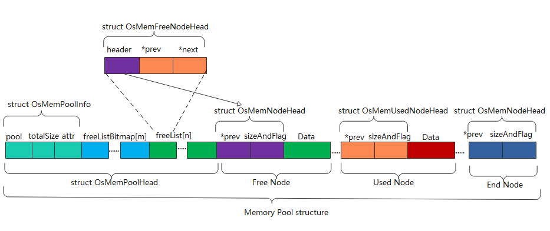

**其二**,LiteOS-m根据**长度**对**空闲内存块**进行了划分,首先将字节在```[4:127]```的内存块等长地划分为了31个一级区间,每个区间对应的内存块长度都是4的整数倍(4,8,12.....124),每个区间分配有一级编号```FL(1~31)```.接下来对字节在```2^7:2^31-1```的内存块根据```TLSF(内存两级分配算法)```进行分割,先粗粒度划分,所有在```2^k~2^(k+1)-1```的内存块被划分为一个一级区间,它的一级编号```FL(first level)```，接下来在每个一级区间```2^k~2^(k+1)-1```中以```2^(k-3)```作为分隔片分割成8个二级小区间,拥有标号```SL(second level)```
因此，不同的内存块经过TLSF分割成了最细粒度的内存单元，包括[4:127]的31个一级区间和和```2^7:2^31-1```的个二级区间,每个区间的空闲内存块将由一个空闲链表维护,一共223个空闲链表,他们的头节点都是```空闲内存链表数组freeList[]```的元素
**由此,通过维护一个空闲链表数组的方式,实现了对特定大小区间内存块的直接访问,访问的时间复杂度大大降低**

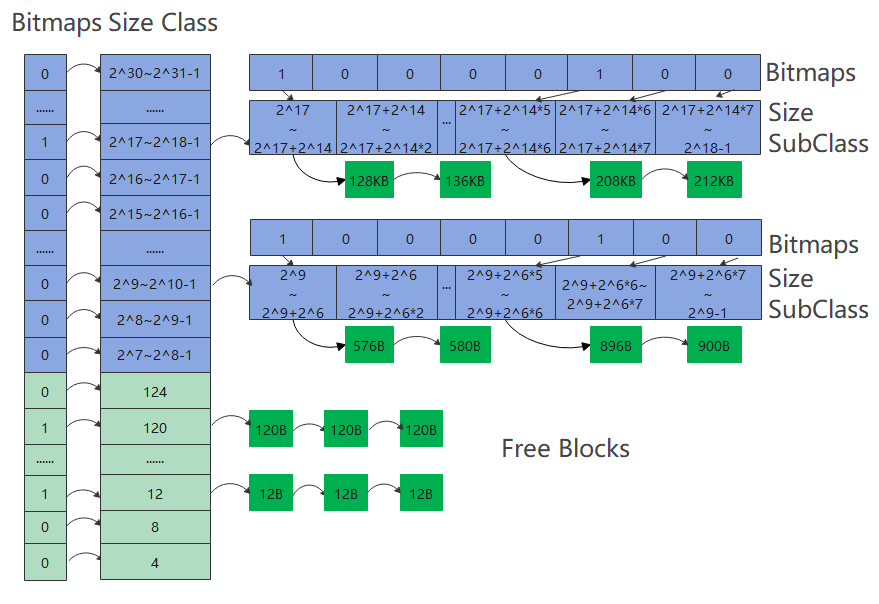

### 内存操作

LiteOS-M的memory模块实现的内存操作API主要有以下:

#### ```LOS_MemInit()```:

功能是,接受到将要作为内存池的一片内存块的**起始地址与长度**,对内存池头节点```OsMemPoolHead```结构体进行初始化起始地址和长度,对尾部哨兵节点初始化,将剩余的内存块长度视作一个空闲节点,初始内存块的头节点```OsMemNodeHead```(将```sizeAndFlag```赋予内存块长度等信息),并将其挂载到空闲链表数组中。

#### ```LOS_MemAlloc()```:

功能是,根据接收到的内存池头节点的起始位置,需要申请的内存块大小,从而使用```bestfit```内存分配算法,先从所申请内存块长度所在区间对应的```freeList```数组元素链表中寻找适合的内存块,对应空间没有空闲内存块,则向更大的区间搜索,如果搜索成功,则将该内存块分割成两块,分别更改内存块头节点```OsMemNodeHead```的信息(将前者标记为使用,后者标记为空闲),将前者从空闲链表取出作返回值,将后者挂入空闲链表,**LOS_MemAlloc实现了对内存需求既快又准的分配**

#### ```LOS_MemFree()```:

这个API与```LOS_MemFree()```恰好相反,通过获得内存池起始地址以及所释放内存块起始地址,LiteOS-M可以将其挂载到空闲链表上,并标记为空闲,**此外LiteOS-M为了避免内存块不断分割产生过多碎片的问题,在释放时,会试图合并该节点与其在内存池中的前驱节点(如果前驱节点仍然空闲)**

#### ```LOS_MemAllocAlign()```:

功能是申请一块边界对齐的内存块,其中对齐边界由传入参数boundary给定,LiteOS-M的实现策略是,申请一块大小为size+boundary的内存块,将对齐后的内存返回,这块内存既对齐boundary又满足不小于size,由于对齐损失的内存区域被称为gap,会有给定区域存放gapsize,并且会标记sizeAndFalg的部分区域,表示它是一个```AlignGap```节点

#### ```LOS_MemRealloc()```

功能是给定一个已分配的内存块给定地址,重新分配一个给定大小的内存块,其策略是由以上API由一些基础操作组成,比如内存块的查找、内存块的合并、内存块的分割,LiteOS-M将这些基础操作封装成了一下函数:

#### 1.合并 ```OsMemMergeNode()```

```OsMemMergeNode(struct OsMemNodeHead *node)```将给定节点node与它的前一个空闲节点进行合并,形成的新节点,节点头为前一个节点的头

```c
STATIC INLINE VOID OsMemMergeNode(struct OsMemNodeHead *node)
{
    struct OsMemNodeHead *nextNode = NULL;

    node->ptr.prev->sizeAndFlag += node->sizeAndFlag;//扩大内存块长度
    nextNode = (struct OsMemNodeHead *)((UINTPTR)node + node->sizeAndFlag); //前者指向后者之后的一个节点
    if (!OS_MEM_NODE_GET_LAST_FLAG(nextNode->sizeAndFlag) && !OS_MEM_IS_GAP_NODE(nextNode)) {
        nextNode->ptr.prev = node->ptr.prev;
    }
}
```

#### 2.分割```OsMemSplitNode()```

```VOID OsMemSplitNode(VOID *pool, struct OsMemNodeHead *allocNode, UINT32 allocSize)```将根据所需的内存块长度,将allocNode分割成所需大小节点和剩余节点```newFreeNode```(并且初始化newFreeNode的节点头),如果newFreeNode的后一节点(如果有)也是未使用节点,把后一节点从链表上删除,将二者合并(可能是为了减少碎块),并重新插入链表(新分割出的newFreeNode本身并不在链表上)

```c
STATIC INLINE VOID OsMemSplitNode(VOID *pool, struct OsMemNodeHead *allocNode, UINT32 allocSize)
{
    struct OsMemFreeNodeHead *newFreeNode = NULL;
    struct OsMemNodeHead *nextNode = NULL;

    newFreeNode = (struct OsMemFreeNodeHead *)(VOID *)((UINT8 *)allocNode + allocSize); 
    newFreeNode->header.ptr.prev = allocNode; //初始化新分割节点
    newFreeNode->header.sizeAndFlag = allocNode->sizeAndFlag - allocSize;
    allocNode->sizeAndFlag = allocSize;
    nextNode = OS_MEM_NEXT_NODE(&newFreeNode->header);
    if (!OS_MEM_NODE_GET_LAST_FLAG(nextNode->sizeAndFlag) && !OS_MEM_IS_GAP_NODE(nextNode)) {
        nextNode->ptr.prev = &newFreeNode->header;
        if (!OS_MEM_NODE_GET_USED_FLAG(nextNode->sizeAndFlag)) {
            OsMemFreeNodeDelete(pool, (struct OsMemFreeNodeHead *)nextNode);
            OsMemMergeNode(nextNode);
        }
    }

    OsMemFreeNodeAdd(pool, newFreeNode); //挂上空闲链表
}
```

#### 3.找到满足大小的内存块```OsMemFreeNodeGet(VOID *pool, UINT32 size)```

该函数接收size作为申请内存块的长度,先通过计算所需内存块对应的FL和SL(属于的区间),检查其bitmap是否为1,如果如此,说明恰好有空闲等大空间,直接返回,反之,向更长的的区间去寻找,然后把获取到的内存块**从空闲内存链表删除**，返回内存节点地址。

```c
STATIC INLINE struct OsMemNodeHead *OsMemFreeNodeGet(VOID *pool, UINT32 size)
{
    struct OsMemPoolHead *poolHead = (struct OsMemPoolHead *)pool;
    UINT32 index;
    struct OsMemFreeNodeHead *firstNode = OsMemFindNextSuitableBlock(pool, size, &index);
    if (firstNode == NULL) {
        return NULL;
    }

    OsMemListDelete(poolHead, index, firstNode);//将其从空闲链表中删去

    return &firstNode->header;
}
```

### 内存保护检查

LiteOS-M对内存具有一定的检查能力,其中包括：
1. 空指针检查:LiteOS-M在部分函数内部会对传入的指针进行是否为空的判断。
   
2. 对齐性检查:LiteOS-M规定动态内存的对齐边界是4的整数倍,因此在接收到传入地址时会对其是否对齐进行判断。
   
```c
if (((UINTPTR)pool & (OS_MEM_ALIGN_SIZE - 1)) || \ //空指针与对齐性检查
        (size & (OS_MEM_ALIGN_SIZE - 1))) {
        PRINT_ERR("LiteOS heap memory address or size configured not aligned:address:0x%x,size:0x%x, alignsize:%d\n", \
                  (UINTPTR)pool, size, OS_MEM_ALIGN_SIZE);
        return LOS_NOK;
    }
```

3. 魔术字检查:LiteOS-M通过设立一个魔术字```magic```来检测该内存块是否被恶意篡改,这个魔术字较为独特,当该块有效时保证魔术字不被改变,如果该处被覆写则说明被其他内存块覆盖。
   
``` c
#define OS_MEM_NODE_MAGIC          0xABCDDCBA //魔术字定义
#define OS_MEM_SET_MAGIC(node)      ((node)->magic = OS_MEM_NODE_MAGIC) //魔术字设置
#define OS_MEM_MAGIC_VALID(node)    ((node)->magic == OS_MEM_NODE_MAGIC) //魔术字检查
```

4. 内存锁:LiteOS-M允许对访问内存的一些特殊操作上锁,以防止并行进程同时访问时引发的读者写者问题

```c
#define MEM_LOCK(pool, state)       do {                    \
    if (!((pool)->info.attr & OS_MEM_POOL_UNLOCK_ENABLE)) { \
        (state) = LOS_IntLock();                            \
    }                                                       \
} while (0);   // 加锁操作，如果池没有启用无锁，则执行锁定
#define MEM_UNLOCK(pool, state)     do {                    \
    if (!((pool)->info.attr & OS_MEM_POOL_UNLOCK_ENABLE)) { \
        LOS_IntRestore(state);                              \
    }                                                       \
} while (0);
```

## 改写过程中遇到的技术问题及解决方法

### 问题一：被改写的c文件依赖的头文件

在改写los_memory.c时，首先遇到的问题是如何在改写的.rs代码中引入源代码依赖的头文件内容。
在los_memory.c中，不乏有这些引入头文件的语句：

```c
#include "los_memory.h"
#include "securec.h"
#include "los_arch.h"
#include "los_config.h"
#include "los_debug.h"
#include "los_hook.h"
#include "los_interrupt.h"
#include "los_task.h"
...
```

rust代码是无法直接识别c语言编写的代码的，因此有必要将这些库文件~~翻译~~绑定为.rs库，再通过在主代码所在文件使用`mod`命令引入绑定库。

在头文件代码量较小、头文件结构简单的情况下，可以选择手动地编写相应的库文件。但是考虑到los_memory.c引入的头文件文件内容多、嵌套引入其他头文件导致结构复杂，这种人工编写的工作量太大，因此有必要使用一些自动化生成绑定库文件的工具。

#### 解决方案：使用bindgen工具

bindgen工具的使用方法如下：

它的命令格式为：`bindgen header.h -o bindings.rs -I /path/to/include`，其中`header.h`是改写代码原来需要引入的头文件，`bindings.rs`是其对应的绑定头文件，`-I`选项表示后面是此头文件依赖的其它头文件的寻找路径，这个选项很好地解决了头文件嵌套引入其它头文件的问题，我们只需要将顶层头文件及其依赖的所有子头文件放在同一目录下，后面`-I`选项便可以直接舍去。

bindgen工具做了以下工作：

- 类型映射：将C语言的基本类型(如int、char)与复杂类型(如struct、union)映射到Rust的对应类型；
  
  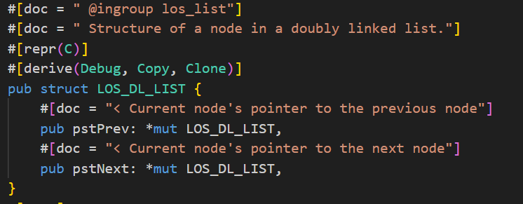

- 函数映射：C 函数声明映射为 Rust 函数声明，包括参数和返回类型；

 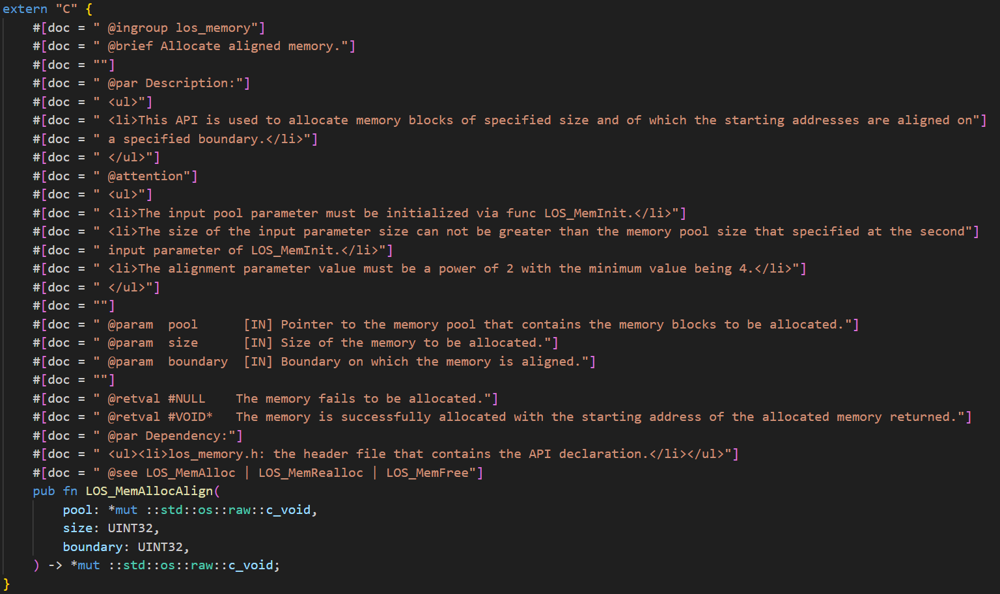

- 常量映射：C 中的 `#define` 宏定义通常映射为 Rust 中的 `const` 常量或者 `static` 变量；
  
 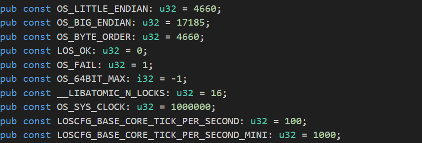

在这些绑定库生成完成后，可以直接在顶层代码文件调用库的内容。

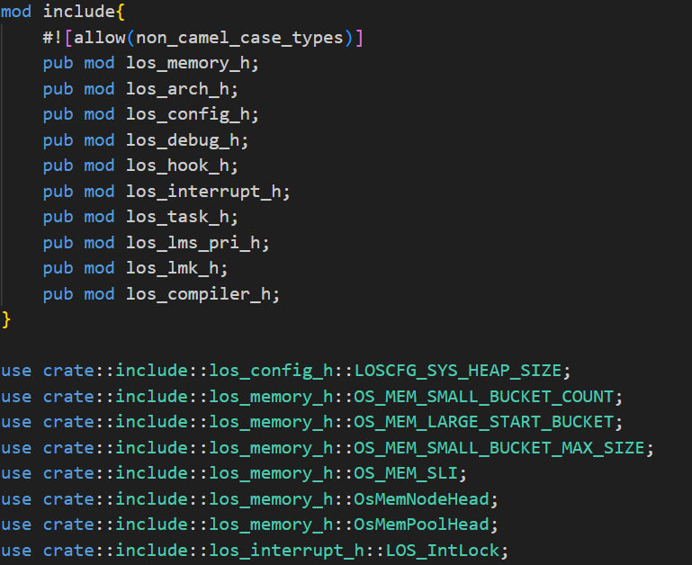

### 问题二：C语言中的条件编译

los_memory.c里包含大量的类似的条件编译代码：

```c
#if (LOSCFG_TASK_MEM_USED != 1 && LOSCFG_MEM_FREE_BY_TASKID == 1)
#define OS_MEM_NODE_USED_FLAG      (1U << 25) // 节点正在使用的标志
#define OS_MEM_NODE_ALIGNED_FLAG   (1U << 24) // 节点对齐标志
#if (LOSCFG_MEM_LEAKCHECK == 1)
#define OS_MEM_NODE_LEAK_FLAG      (1U << 23) // 内存泄漏检查标志
#else
#define OS_MEM_NODE_LEAK_FLAG      0
#endif
#if (OS_MEM_EXPAND_ENABLE == 1)
#define OS_MEM_NODE_LAST_FLAG      (1U << 22)   /* Sentinel Node，哨兵节点标志 */
#else
#define OS_MEM_NODE_LAST_FLAG      0
#endif
#else
#define OS_MEM_NODE_USED_FLAG      (1U << 31)
#define OS_MEM_NODE_ALIGNED_FLAG   (1U << 30)
#if (LOSCFG_MEM_LEAKCHECK == 1)
#define OS_MEM_NODE_LEAK_FLAG      (1U << 29)
#else
#define OS_MEM_NODE_LEAK_FLAG      0
#endif
#if (OS_MEM_EXPAND_ENABLE == 1)
#define OS_MEM_NODE_LAST_FLAG      (1U << 28)   /* Sentinel Node，哨兵节点标志 */
#else
#define OS_MEM_NODE_LAST_FLAG      0
#endif
#endif
```

条件编译语句属于是编译器预处理，而rust里没有直接的等价物。如果不解决这些条件编译的问题，可能会导致rust代码无法处理C语言原来的条件逻辑，影响代码执行的正确性。

#### 解决方案：使用Rust的cfg属性和Cargo的feature特性

Rust 中的 cfg 属性允许根据编译器的配置和条件来选择性地编译代码块。Cargo 的特性（features）允许在构建时根据用户的选择来编译不同的代码路径。`Cargo.toml`文件中可以定义特性，并在代码中使用这些特性来管理条件编译。

我们可以在`Cargo.toml`文件下加入我们需要调控的属性，然后在default中选择我们要开启的属性，并将其加入，便可以实现feature的设置。

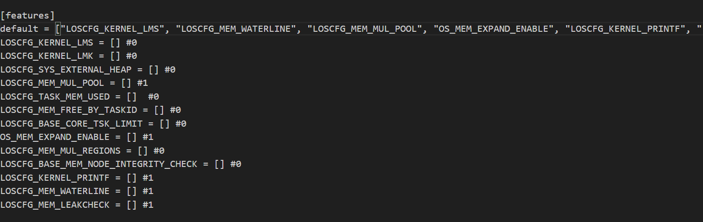

在rs代码内部，使用`#[cfg(feature = "xxx")]`以及结合各种逻辑语句如`not()`、`any()`、`all()`等，便可实现各种逻辑的条件编译了。

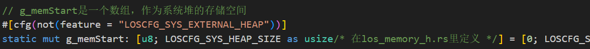

### 问题三：C源代码中的裸指针缺乏安全机制

原来的`los_memory.c`文件中包含了大量不安全的操作，如对一个指针进行类型转换再访问其成员变量而不在使用前对其进行检查，可能会导致非法的访问。除此之外有一些对于指针的操作用宏进行表示，缺乏类型检查，虽然C语言能够进行数据类型的隐式转换，但是转换过程中可能存在安全隐患(缓冲区溢出)。基于这些安全问题，我们小组也进行了修改方案的讨论。

```C
//不安全的宏定义
#define OS_MEM_MARK_GAP_NODE(node)  \
    (((struct OsMemNodeHead *)(node))->ptr.prev = (struct OsMemNodeHead *)OS_MEM_GAP_NODE_MAGIC)
#define OS_MEM_IS_GAP_NODE(node)    \
    (((struct OsMemNodeHead *)(node))->ptr.prev == (struct OsMemNodeHead *)OS_MEM_GAP_NODE_MAGIC)
```

#### 解决方案：利用Rust里的Option类型及编译器检查机制

在Rust中，使用 Option 类型可以显式地处理可能为空的情况：

```Rust
fn main() {
    let some_value: Option<char> = None;
    match some_value {
        Some(v) => println!("{}", v),
        None => println!("No value"),
    }
}
```

在Rust中，编译器强制要求你处理 Option 的两种情况（Some 和 None），从而避免了空指针解引用的问题。

除此之外，Rust的 Option 类型使得错误处理变得更加明确和安全。使用 `unwrap` 或者 `expect`可以在调试时快速定位错误：

```rust
let some_value: Option<i32> = Some(10);
let value = some_value.expect("Expected a value, but got None");
```

如果 `some_value` 是 `None`，程序会立刻崩溃，并且提供错误信息，帮助开发者快速定位问题。

Rust的类型系统在编译时进行严格检查，确保所有 Option 类型的值都被正确处理。这避免了运行时错误，提高了代码的可靠性和安全性。

### 问题四：写好的rust代码如何被C代码调用和测试

rust代码文件显然也是不能直接被C文件识别的，并且梁总语言的函数调用约定可能不兼容，会导致调用失败或行为异常。

除此之外，Rust和C的编译器会对函数的名称进行不同的修饰，导致函数名在调用时可能无法进行匹配。
Rust和C的数据类型也可能不完全兼容，导致内存对齐和大小问题。

#### 解决方案：利用C和Rust之间的ABI接口

对于要编译成C可以识别的代码的函数，需要在前面添加`#[no_mangle]`属性，告诉编译器不修改其函数名，便于C调用Rust编写的函数时能够匹配上。

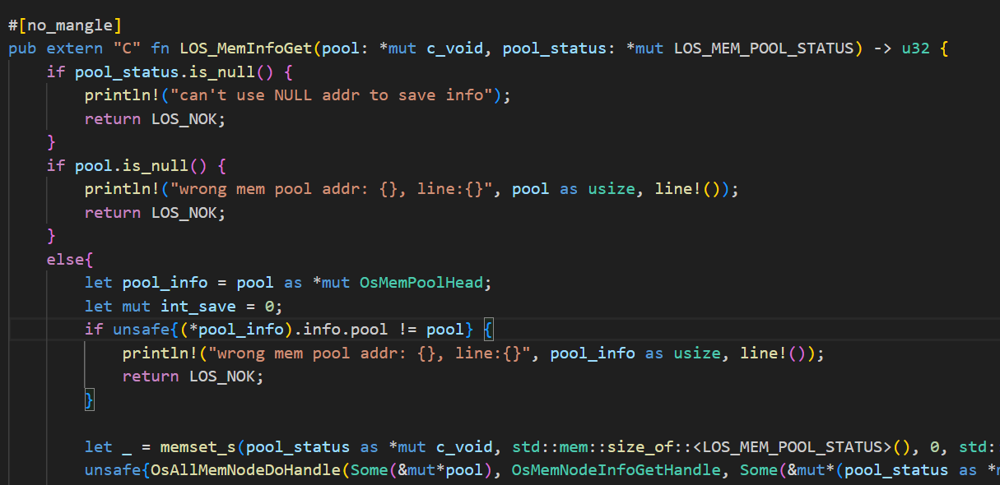

为了解决Rust和C之间数据结构不完全兼容的问题，对于复杂的数据类型，需要使用`#[repr(C)]`属性来指定与C兼容的内存布局。

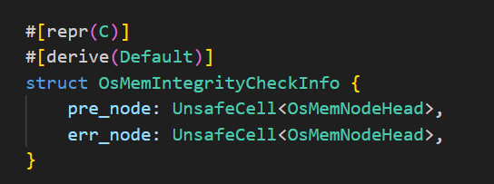

除了以上的步骤，还需要将Rust代码编译成静态库，通过gcc工具将C语言编写的测试代码和静态库一起编译，才能够实现C调用Rust。因此需要进行以下步骤：
- 使用`cargo build --release`命令对rust代码进行编译，并且编译类型为静态库；

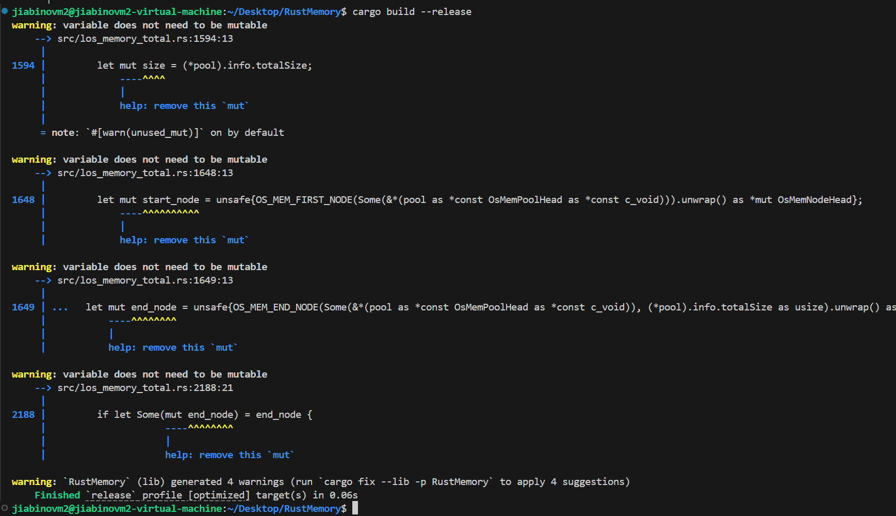

编译后获得的静态库会位于当前目录下的target/release文件夹下。

```
静态库所在路径示意图
.
├── Cargo.lock
├── Cargo.toml
├── cbindgen.toml
├── test.c            //测试文件
├── los_memory_c.h    //通过cbindgen工具生成的头文件
├── src
│   ├── include
│   │   ├── los_arch_h.rs
│   │   ├── los_compiler_h.rs
│   │   ├── los_config_h.rs
│   │   ├── los_debug_h.rs
│   │   ├── los_hook_h.rs
│   │   ├── los_interrupt_h.rs
│   │   ├── los_lmk_h.rs
│   │   ├── los_lms_pri_h.rs
│   │   ├── los_memory_h.rs
│   │   └── los_task_h.rs
│   └── los_memory_total.rs
└── target
    ├── CACHEDIR.TAG
    └── release
        ├── build
        │   ├── libc-068a28cbb438af1e
        │   │   ├── invoked.timestamp
        │   │   ├── out
        │   │   ├── output
        │   │   ├── root-output
        │   │   └── stderr
        │   └── libc-3633f0fdef7962b6
        │       ├── build-script-build
        │       ├── build_script_build-3633f0fdef7962b6
        │       └── build_script_build-3633f0fdef7962b6.d
        ├── deps
        │   ├── libc-c5612f9a5292525b.d
        │   ├── liblibc-c5612f9a5292525b.rlib
        │   ├── liblibc-c5612f9a5292525b.rmeta
        │   ├── liblos_memory_lib-a34481ce0f3fd44d.a
        │   └── los_memory_lib-a34481ce0f3fd44d.d
        ├── examples
        ├── incremental
        ├── liblos_memory_lib.a //静态库
        └── liblos_memory_lib.d //静态库
```
将rust代码编译成静态库后，还需要将测试代码与静态库一起编译，测试代码需要用到一个用cbindgen工具生成的头文件，这个头文件包含了Rust代码暴露给C代码的函数、数据类型等接口。
使用cbindgen生成头文件首先需要在库目录下新增`cbindgen.toml`文件，里面的配置内容为

```toml
language = "C"
```

执行命令`cbindgen --config cbindgen.toml --crate 库目录名称 --output 输出文件名.h`

最后在C测试文件中引入该头文件，通过以下命令编译测试程序：
```
gcc -o (可执行文件名字) (测试文件名字).c -I. -Ltarget/release -l(Cargoo文件中定义的lib名字) -ldl -lpthread -Wl,-gc-section
```

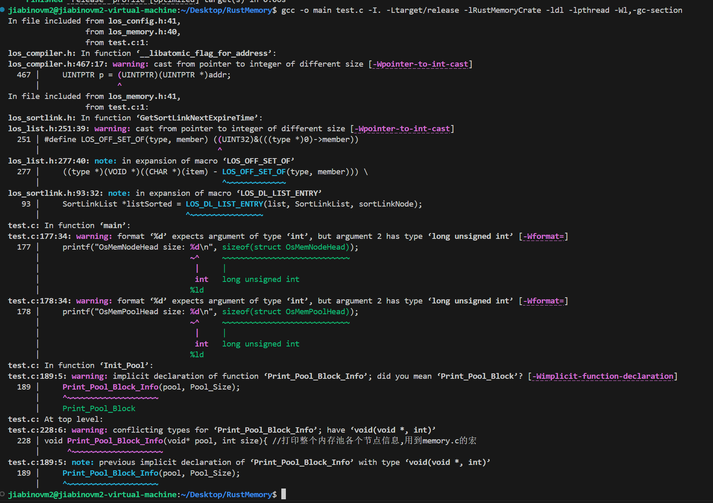

至此，Rust改写过程中遇到的绝大部分问题已解决。

## 改写测试
### 可行性测试

为了测试我们的memory模块能够正常工作,我们对内存池初始化、内存的分配、内存的销毁、内存的显示等多个基础功能进行了测试,测试文件如下:

```c
#include "los_config.h"
#include "los_compiler.h"
#include "los_memory.h"
#include <stdlib.h>
#include <stdio.h>

#define Pool_Size 10000 //内存池大小
#define Region_Size 400 //分配块大小
#define Boundary 32  //边界对齐设置

void Print_Pool_Info(void* pool); //打印内存信息

void* Init_Pool(); //初始内存池

void AllocAlign_Test(void* pool); //测试对齐内存的申请
int main(){
    int ret;
    int i;
    void* pool = Init_Pool();
    Print_Pool_Info(pool);
    LOS_MemAlloc(pool,Region_Size);
    Print_Pool_Info(pool);
    void* block = LOS_MemAllocAlign(pool,Region_Size,Boundary);
    Print_Pool_Info(pool);
    block = LOS_MemRealloc(pool,block,800);
    Print_Pool_Info(pool);
    LOS_MemFree(pool,block);
    Print_Pool_Info(pool);
}

void* Init_Pool(){
    void* pool = (void*)malloc(Pool_Size);
    int ret = LOS_MemInit(pool,Pool_Size); //初始化内存池
    if(ret == LOS_NOK){
        printf("LOS_MemInit UNSUCCESS\n");
        exit(-1);
    }
    else{
        printf("LOS_MemInit SUCCESS\n");
        return pool;
    }
}


void Print_Pool_Info(void* pool){
    LOS_MEM_POOL_STATUS *poolStatus = (LOS_MEM_POOL_STATUS*)malloc(sizeof(LOS_MEM_POOL_STATUS));
    LOS_MemInfoGet(pool,poolStatus);
    printf
    ("----------------------------------------\npoolsize = %d\ntotalUsedSize = %d\ntotalFreeSize = %d\nmaxFreeNodeSize = %d\nusedNodeNum = %d\nfreeNodeNum = %d\n-----------------------------------------\n",
    LOS_MemPoolSizeGet(pool),poolStatus->totalUsedSize,poolStatus->totalFreeSize,poolStatus->maxFreeNodeSize,poolStatus->usedNodeNum,poolStatus->freeNodeNum);
    free(poolStatus);
    return;
}
```
运行后,得到如图信息:

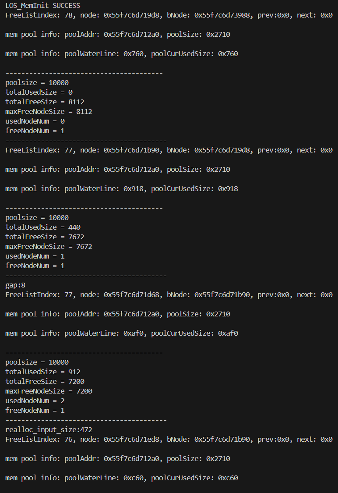

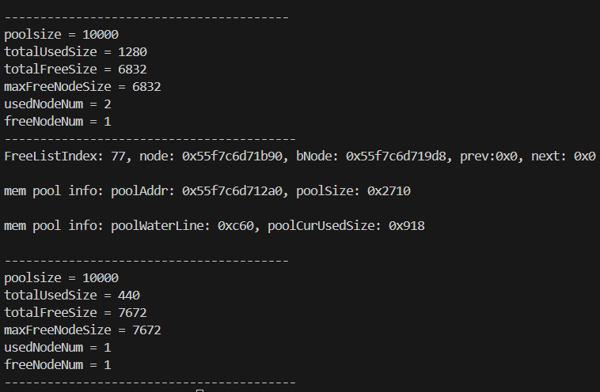

其结果符合预期,说明模块可以正常提供内存管理功能

### 安全性测试

在安全性测试中,我们主要聚焦于接口函数对空指针的处理能力,以及对申请内存块的临界做出测试,为此,编写如下测试文件:

```c
#include "los_config.h"
#include "los_compiler.h"
#include "los_memory.h"
#include <stdlib.h>
#include <stdio.h>

#define Normal_Pool_Size 10000
#define Small_Pool_Size 100
#define Large_Pool_Size 10000000
#define Small_Alloc_Size 1
#define Large_Alloc_Size 10000 //more than NormalPoolSize

void Print_Pool_Info(void* pool);

void* Init_Pool();


int main(){
    //内存池初始化悬空指针测试---------------------------
    void* pool = NULL;
    printf("悬空指针测试\n");
    int ret = LOS_MemInit(pool,10000);
    if(ret == LOS_NOK){
        printf("ptr is null\n");
    }
    //初始化内存池过大测试----------------------
    printf("初始化内存过大测试\n");
    ret = LOS_MemInit(pool,Large_Pool_Size);
    if(ret == LOS_NOK){
        printf("memory pool is too large\n");
    }
    //初始化内存池过小测试---------------------
    printf("初始化内存过小测试\n");
    ret = LOS_MemInit(pool,Small_Pool_Size);
    if(ret == LOS_NOK){
        printf("memory pool is too small\n");
    }
    //分配内存块过大测试
    printf("分配内存块过大测试\n");
    pool = (void*)malloc(Normal_Pool_Size);//正常初始化内存池
    LOS_MemInit(pool,Normal_Pool_Size);
    void* block = LOS_MemAlloc(pool,Large_Alloc_Size);
    if(block == NULL){
        printf("alloc memory is too large\n");
    }
}
```
运行可得

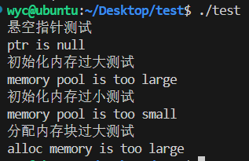

符合预期,说明改写的memory模块对不安全行为能够进行检测


## 项目总结

1. 我们学习了Rust这门编程语言，了解了C在隐式转换等问题上可能出现的漏洞，从此养成了更加规范的编程和变量命名习惯。

2. 对操作系统的内存处理模块有了更深的了解。在操作系统中内存是如何被创建，分配和销毁的，在改写过程中我们有了更深的体会。

3. 团队合作与分工。有一句非洲谚语：“一个人能走的很快，但一群人才能走的很远。”在面对几千行代码的漫长艰巨的改写过程中，团队间相互扶持，才能越走越远。

### 成果

实现了LiteOS-M的动态内存模块los_memory.c的改写，rust代码总量3000+,用rust编译器编译无误。

用rust语言提高了LiteOS-M动态内存模块的安全性。

### 不足

没有实现一开始目标中task.c的改写，只完成了los_memory.c的改写
没有实现加入改写后的rust文件的整个LiteOS-M内核的编译运行。

### 展望

1. 利用gn和Ninja等工具，在仿照原有编译配置文件的基础上，尝试将Rust和现有的C代码完整编译成完整的LiteOS-M内核，并进行内核安全性和性能测试。

2. 改写剩余代码，实现完全由Rust实现的嵌入式LiteOS系统。

