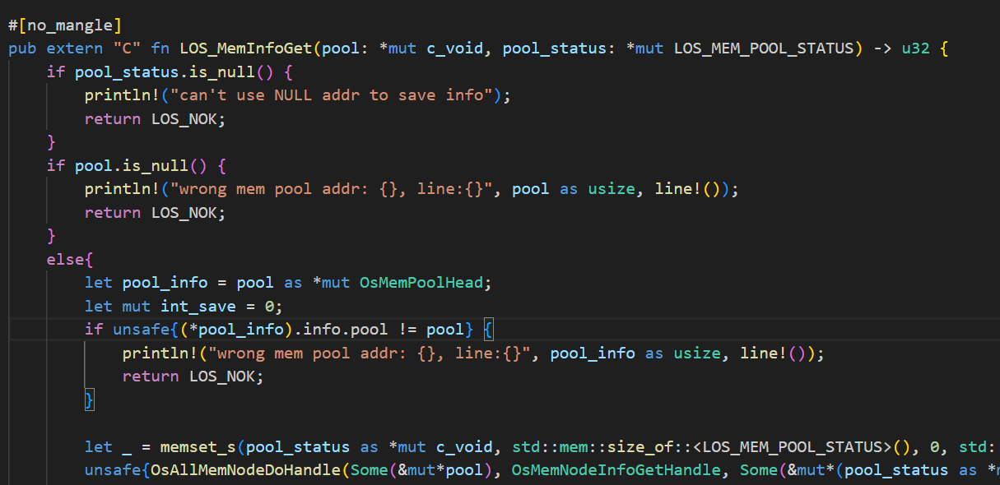

## 改写过程中遇到的技术问题及解决方法
### 问题一：被改写的c文件依赖的头文件
在改写los_memory.c时，首先遇到的问题是如何在改写的.rs代码中引入源代码依赖的头文件内容。
在los_memory.c中，不乏有这些引入头文件的语句：
```c
#include "los_memory.h"
#include "securec.h"
#include "los_arch.h"
#include "los_config.h"
#include "los_debug.h"
#include "los_hook.h"
#include "los_interrupt.h"
#include "los_task.h"
...
```
rust代码是无法直接识别c语言编写的代码的，因此有必要将这些库文件~~翻译~~绑定为.rs库，再通过在主代码所在文件使用`mod`命令引入绑定库。
在头文件代码量较小、头文件结构简单的情况下，可以选择手动地编写相应的库文件。但是考虑到los_memory.c引入的头文件文件内容多、嵌套引入其他头文件导致结构复杂，这种人工编写的工作量太大，因此有必要使用一些自动化生成绑定库文件的工具。

#### 解决方案：使用bindgen工具
bindgen工具的使用方法如下：
它的命令格式为：`bindgen header.h -o bindings.rs -I /path/to/include`，其中`header.h`是改写代码原来需要引入的头文件，`bindings.rs`是其对应的绑定头文件，`-I`选项表示后面是此头文件依赖的其它头文件的寻找路径，这个选项很好地解决了头文件嵌套引入其它头文件的问题，我们只需要将顶层头文件及其依赖的所有子头文件放在同一目录下，后面`-I`选项便可以直接舍去。
bindgen工具做了以下工作：
- 类型映射：将C语言的基本类型(如int、char)与复杂类型(如struct、union)映射到Rust的对应类型；
  
- 函数映射：C 函数声明映射为 Rust 函数声明，包括参数和返回类型；
  
- 常量映射：C 中的 `#define` 宏定义通常映射为 Rust 中的 `const` 常量或者 `static` 变量；
  

在这些绑定库生成完成后，可以直接在顶层代码文件调用库的内容。


### 问题二：C语言中的条件编译
los_memory.c里包含大量的类似的条件编译代码：
```c
#if (LOSCFG_TASK_MEM_USED != 1 && LOSCFG_MEM_FREE_BY_TASKID == 1)
#define OS_MEM_NODE_USED_FLAG      (1U << 25) // 节点正在使用的标志
#define OS_MEM_NODE_ALIGNED_FLAG   (1U << 24) // 节点对齐标志
#if (LOSCFG_MEM_LEAKCHECK == 1)
#define OS_MEM_NODE_LEAK_FLAG      (1U << 23) // 内存泄漏检查标志
#else
#define OS_MEM_NODE_LEAK_FLAG      0
#endif
#if (OS_MEM_EXPAND_ENABLE == 1)
#define OS_MEM_NODE_LAST_FLAG      (1U << 22)   /* Sentinel Node，哨兵节点标志 */
#else
#define OS_MEM_NODE_LAST_FLAG      0
#endif
#else
#define OS_MEM_NODE_USED_FLAG      (1U << 31)
#define OS_MEM_NODE_ALIGNED_FLAG   (1U << 30)
#if (LOSCFG_MEM_LEAKCHECK == 1)
#define OS_MEM_NODE_LEAK_FLAG      (1U << 29)
#else
#define OS_MEM_NODE_LEAK_FLAG      0
#endif
#if (OS_MEM_EXPAND_ENABLE == 1)
#define OS_MEM_NODE_LAST_FLAG      (1U << 28)   /* Sentinel Node，哨兵节点标志 */
#else
#define OS_MEM_NODE_LAST_FLAG      0
#endif
#endif
```
条件编译语句属于是编译器预处理，而rust里没有直接的等价物。如果不解决这些条件编译的问题，可能会导致rust代码无法处理C语言原来的条件逻辑，影响代码执行的正确性。
#### 解决方案：使用Rust的cfg属性和Cargo的feature特性
Rust 中的 cfg 属性允许根据编译器的配置和条件来选择性地编译代码块。Cargo 的特性（features）允许在构建时根据用户的选择来编译不同的代码路径。`Cargo.toml`文件中可以定义特性，并在代码中使用这些特性来管理条件编译。

我们可以在`Cargo.toml`文件下加入我们需要调控的属性，然后在default中选择我们要开启的属性，并将其加入，便可以实现feature的设置。

在rs代码内部，使用`#[cfg(feature = "xxx")]`以及结合各种逻辑语句如`not()`、`any()`、`all()`等，便可实现各种逻辑的条件编译了。


### 问题三：C源代码中的裸指针缺乏安全机制
原来的`los_memory.c`文件中包含了大量不安全的操作，如对一个指针进行类型转换再访问其成员变量而不在使用前对其进行检查，可能会导致非法的访问。除此之外有一些对于指针的操作用宏进行表示，缺乏类型检查，虽然C语言能够进行数据类型的隐式转换，但是转换过程中可能存在安全隐患(缓冲区溢出)。基于这些安全问题，我们小组也进行了修改方案的讨论。
```C
//不安全的宏定义
#define OS_MEM_MARK_GAP_NODE(node)  \
    (((struct OsMemNodeHead *)(node))->ptr.prev = (struct OsMemNodeHead *)OS_MEM_GAP_NODE_MAGIC)
#define OS_MEM_IS_GAP_NODE(node)    \
    (((struct OsMemNodeHead *)(node))->ptr.prev == (struct OsMemNodeHead *)OS_MEM_GAP_NODE_MAGIC)
```
#### 解决方案：利用Rust里的Option类型及编译器检查机制
在Rust中，使用 Option 类型可以显式地处理可能为空的情况：
```Rust
fn main() {
    let some_value: Option<char> = None;
    match some_value {
        Some(v) => println!("{}", v),
        None => println!("No value"),
    }
}
```
在Rust中，编译器强制要求你处理 Option 的两种情况（Some 和 None），从而避免了空指针解引用的问题。
除此之外，Rust的 Option 类型使得错误处理变得更加明确和安全。使用 `unwrap` 或者 `expect`可以在调试时快速定位错误：
```rust
let some_value: Option<i32> = Some(10);
let value = some_value.expect("Expected a value, but got None");
```
如果 `some_value` 是 `None`，程序会立刻崩溃，并且提供错误信息，帮助开发者快速定位问题。

Rust的类型系统在编译时进行严格检查，确保所有 Option 类型的值都被正确处理。这避免了运行时错误，提高了代码的可靠性和安全性。

### 问题四：写好的rust代码如何被C代码调用和测试
rust代码文件显然也是不能直接被C文件识别的，并且梁总语言的函数调用约定可能不兼容，会导致调用失败或行为异常。
除此之外，Rust和C的编译器会对函数的名称进行不同的修饰，导致函数名在调用时可能无法进行匹配。
Rust和C的数据类型也可能不完全兼容，导致内存对齐和大小问题。
#### 解决方案：利用C和Rust之间的ABI接口
对于要编译成C可以识别的代码的函数，需要在前面添加`#[no_mangle]`属性，告诉编译器不修改其函数名，便于C调用Rust编写的函数时能够匹配上。

为了解决Rust和C之间数据结构不完全兼容的问题，对于复杂的数据类型，需要使用`#[repr(C)]`属性来指定与C兼容的内存布局。

除了以上的步骤，还需要将Rust代码编译成静态库，通过gcc工具将C语言编写的测试代码和静态库一起编译，才能够实现C调用Rust。因此需要进行以下步骤：
- 使用`cargo build --release`命令对rust代码进行编译，并且编译类型为静态库；

编译后获得的静态库会位于当前目录下的target/release文件夹下。
```
静态库所在路径示意图
.
├── Cargo.lock
├── Cargo.toml
├── cbindgen.toml
├── test.c            //测试文件
├── los_memory_c.h    //通过cbindgen工具生成的头文件
├── src
│   ├── include
│   │   ├── los_arch_h.rs
│   │   ├── los_compiler_h.rs
│   │   ├── los_config_h.rs
│   │   ├── los_debug_h.rs
│   │   ├── los_hook_h.rs
│   │   ├── los_interrupt_h.rs
│   │   ├── los_lmk_h.rs
│   │   ├── los_lms_pri_h.rs
│   │   ├── los_memory_h.rs
│   │   └── los_task_h.rs
│   └── los_memory_total.rs
└── target
    ├── CACHEDIR.TAG
    └── release
        ├── build
        │   ├── libc-068a28cbb438af1e
        │   │   ├── invoked.timestamp
        │   │   ├── out
        │   │   ├── output
        │   │   ├── root-output
        │   │   └── stderr
        │   └── libc-3633f0fdef7962b6
        │       ├── build-script-build
        │       ├── build_script_build-3633f0fdef7962b6
        │       └── build_script_build-3633f0fdef7962b6.d
        ├── deps
        │   ├── libc-c5612f9a5292525b.d
        │   ├── liblibc-c5612f9a5292525b.rlib
        │   ├── liblibc-c5612f9a5292525b.rmeta
        │   ├── liblos_memory_lib-a34481ce0f3fd44d.a
        │   └── los_memory_lib-a34481ce0f3fd44d.d
        ├── examples
        ├── incremental
        ├── liblos_memory_lib.a //静态库
        └── liblos_memory_lib.d //静态库
```
将rust代码编译成静态库后，还需要将测试代码与静态库一起编译，测试代码需要用到一个用cbindgen工具生成的头文件，这个头文件包含了Rust代码暴露给C代码的函数、数据类型等接口。
使用cbindgen生成头文件首先需要在库目录下新增`cbindgen.toml`文件，里面的配置内容为
```toml
language = "C"
```
执行命令`cbindgen --config cbindgen.toml --crate 库目录名称 --output 输出文件名.h`

最后在C测试文件中引入该头文件，通过以下命令编译测试程序：
```
gcc -o (可执行文件名字) (测试文件名字).c -I. -Ltarget/release -l(Cargoo文件中定义的lib名字) -ldl -lpthread -Wl,-gc-section
```


至此，Rust改写过程中遇到的绝大部分问题已解决。
