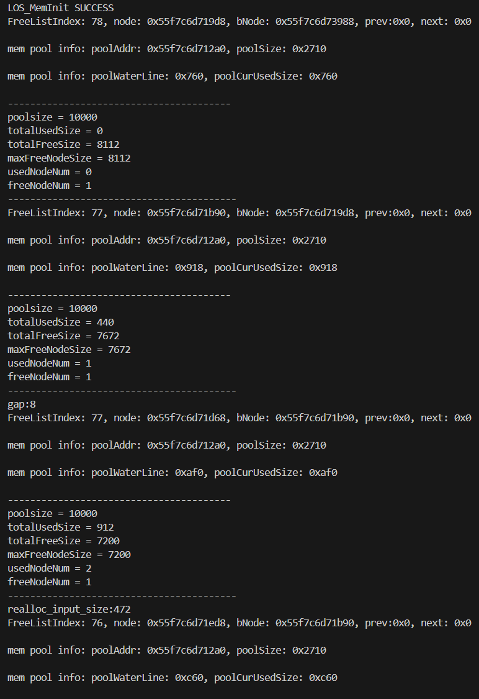
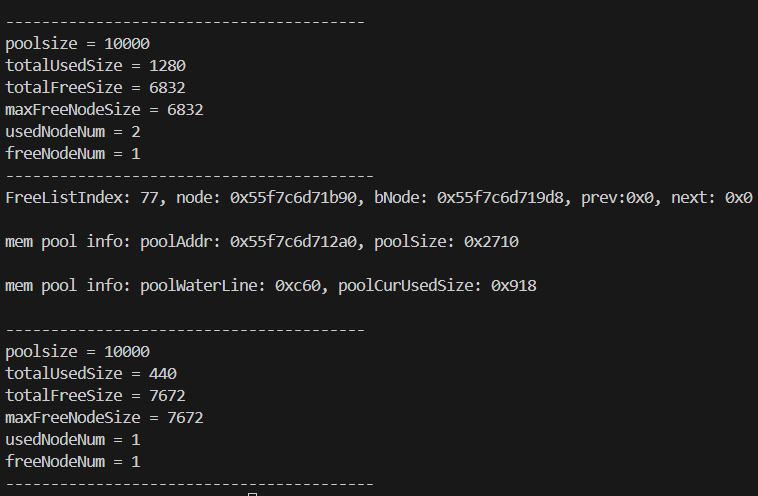
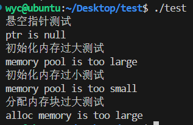

###
#### 可行性测试:
为了测试我们的memory模块能够正常工作,我们对内存池初始化、内存的分配、内存的销毁、内存的显示等多个基础功能进行了测试,测试文件如下:
```c
#include "los_config.h"
#include "los_compiler.h"
#include "los_memory.h"
#include <stdlib.h>
#include <stdio.h>

#define Pool_Size 10000 //内存池大小
#define Region_Size 400 //分配块大小
#define Boundary 32  //边界对齐设置

void Print_Pool_Info(void* pool); //打印内存信息

void* Init_Pool(); //初始内存池

void AllocAlign_Test(void* pool); //测试对齐内存的申请
int main(){
    int ret;
    int i;
    void* pool = Init_Pool();
    Print_Pool_Info(pool);
    LOS_MemAlloc(pool,Region_Size);
    Print_Pool_Info(pool);
    void* block = LOS_MemAllocAlign(pool,Region_Size,Boundary);
    Print_Pool_Info(pool);
    block = LOS_MemRealloc(pool,block,800);
    Print_Pool_Info(pool);
    LOS_MemFree(pool,block);
    Print_Pool_Info(pool);
}

void* Init_Pool(){
    void* pool = (void*)malloc(Pool_Size);
    int ret = LOS_MemInit(pool,Pool_Size); //初始化内存池
    if(ret == LOS_NOK){
        printf("LOS_MemInit UNSUCCESS\n");
        exit(-1);
    }
    else{
        printf("LOS_MemInit SUCCESS\n");
        return pool;
    }
}


void Print_Pool_Info(void* pool){
    LOS_MEM_POOL_STATUS *poolStatus = (LOS_MEM_POOL_STATUS*)malloc(sizeof(LOS_MEM_POOL_STATUS));
    LOS_MemInfoGet(pool,poolStatus);
    printf
    ("----------------------------------------\npoolsize = %d\ntotalUsedSize = %d\ntotalFreeSize = %d\nmaxFreeNodeSize = %d\nusedNodeNum = %d\nfreeNodeNum = %d\n-----------------------------------------\n",
    LOS_MemPoolSizeGet(pool),poolStatus->totalUsedSize,poolStatus->totalFreeSize,poolStatus->maxFreeNodeSize,poolStatus->usedNodeNum,poolStatus->freeNodeNum);
    free(poolStatus);
    return;
}
```
运行后,得到如图信息:


其结果符合预期,说明模块可以正常提供内存管理功能

#### 安全性测试:
在安全性测试中,我们主要聚焦于接口函数对空指针的处理能力,以及对申请内存块的临界做出测试,为此,编写如下测试文件:
```c
#include "los_config.h"
#include "los_compiler.h"
#include "los_memory.h"
#include <stdlib.h>
#include <stdio.h>

#define Normal_Pool_Size 10000
#define Small_Pool_Size 100
#define Large_Pool_Size 10000000
#define Small_Alloc_Size 1
#define Large_Alloc_Size 10000 //more than NormalPoolSize

void Print_Pool_Info(void* pool);

void* Init_Pool();


int main(){
    //内存池初始化悬空指针测试---------------------------
    void* pool = NULL;
    printf("悬空指针测试\n");
    int ret = LOS_MemInit(pool,10000);
    if(ret == LOS_NOK){
        printf("ptr is null\n");
    }
    //初始化内存池过大测试----------------------
    printf("初始化内存过大测试\n");
    ret = LOS_MemInit(pool,Large_Pool_Size);
    if(ret == LOS_NOK){
        printf("memory pool is too large\n");
    }
    //初始化内存池过小测试---------------------
    printf("初始化内存过小测试\n");
    ret = LOS_MemInit(pool,Small_Pool_Size);
    if(ret == LOS_NOK){
        printf("memory pool is too small\n");
    }
    //分配内存块过大测试
    printf("分配内存块过大测试\n");
    pool = (void*)malloc(Normal_Pool_Size);//正常初始化内存池
    LOS_MemInit(pool,Normal_Pool_Size);
    void* block = LOS_MemAlloc(pool,Large_Alloc_Size);
    if(block == NULL){
        printf("alloc memory is too large\n");
    }
}
```
运行可得

符合预期,说明改写的memory模块对不安全行为能够进行检测
