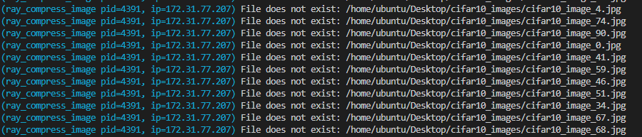
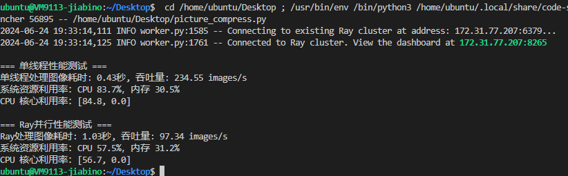
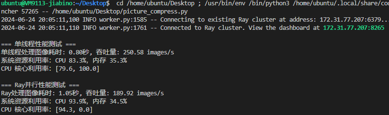
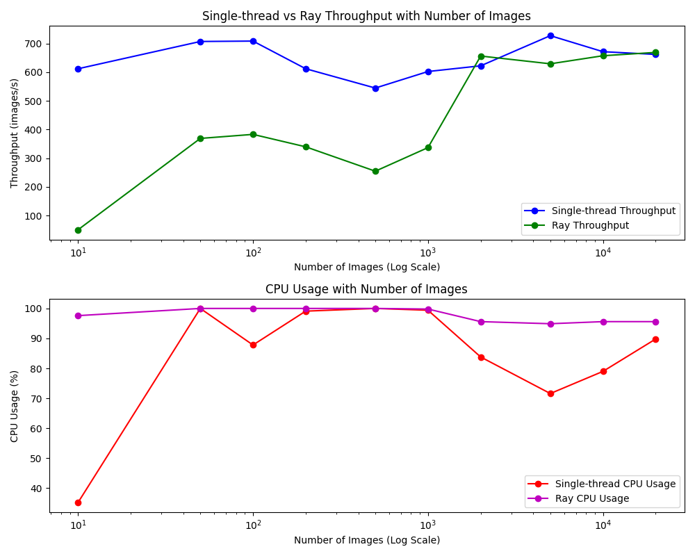
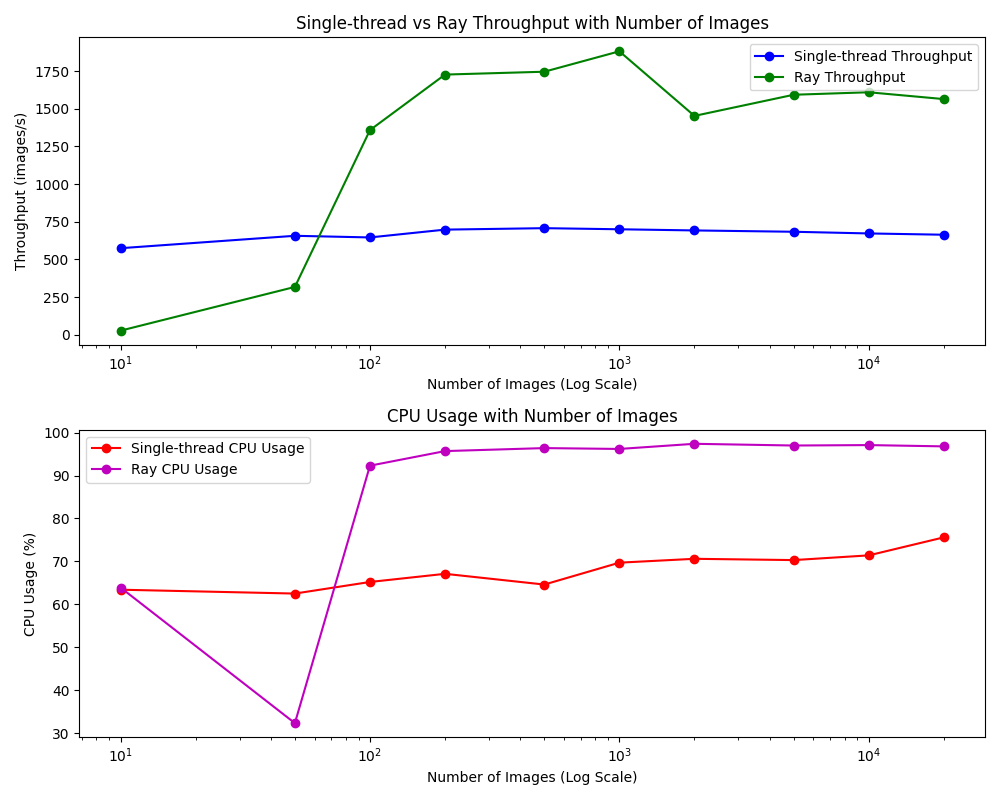
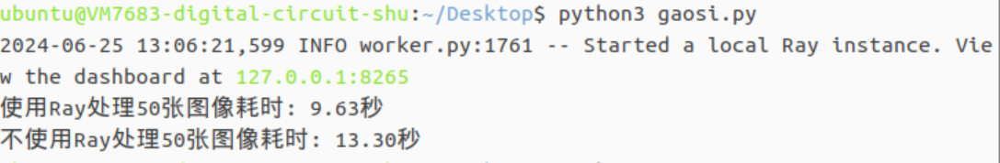
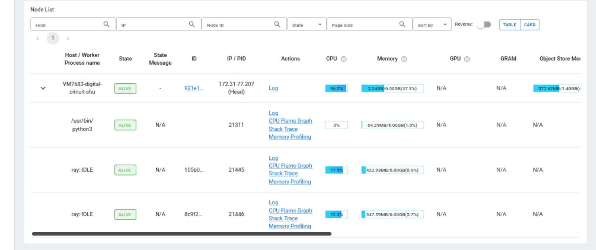
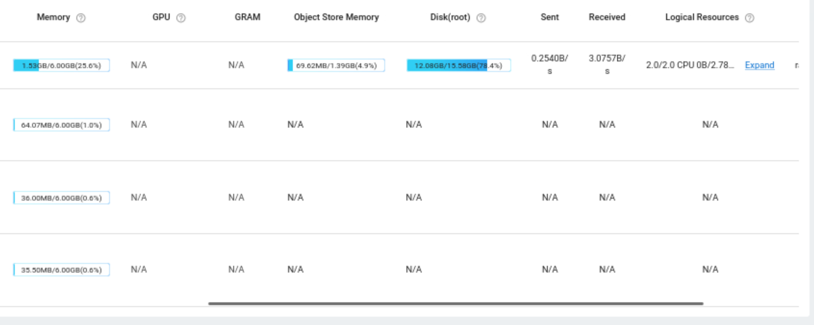
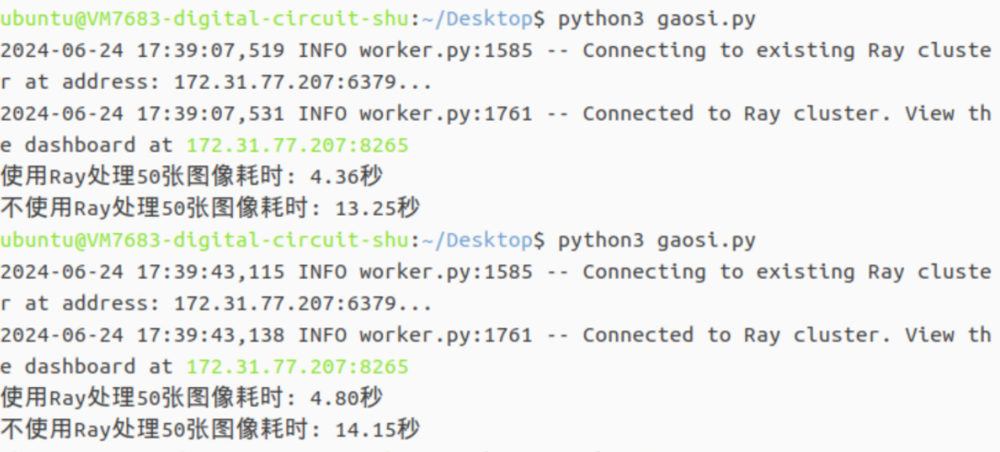
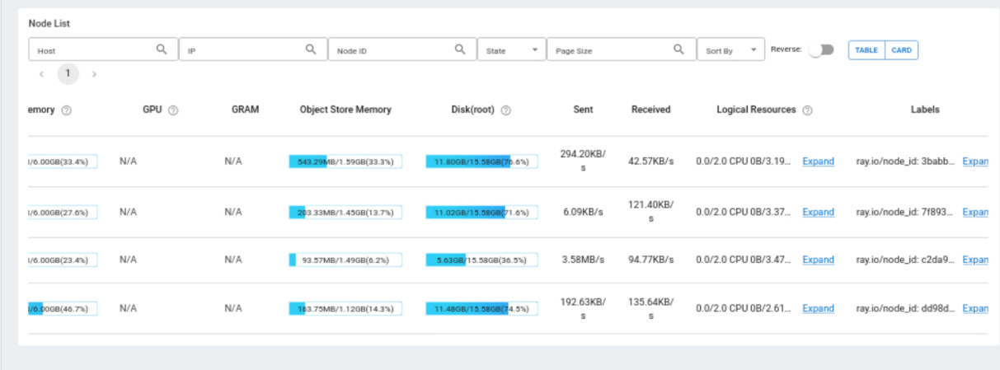

# Lab4说明文档
## 实验说明
Ray 是伯克利大学 RISELab 研发的分布式计算系统，它主要有以下的特点：

1. 提供一种能够构建、运行分布式应用程序的 simple primitives；
2. 从单机扩展到平行，几乎不需要改代码；
3. 拥有良好的生态，能够在 core Ray 上构建复杂的应用程序。

本次实验实验环境为ustc的vlab虚拟机，步骤为进行ray的单机部署、多机部署以及性能测试等工作。

## 单机版部署ray性能测试
### 一、测试程序
我们这里定义了一个简单的任务分发的函数进行测试，测试的源代码如下：
```py
import ray

# 初始化 Ray 集群
ray.init(address='auto')

@ray.remote
def simple_task(x):
    return x * x

# 分发任务到集群上
futures = [simple_task.remote(i) for i in range(10)]

# 收集结果
results = ray.get(futures)

# 打印结果
print("Task results:", results)

# 关闭 Ray
ray.shutdown()

```
测试的结果为：


可以看到部署在虚拟机上的ray节点能够正常的连接并进行工作了。

    
## 二、性能指标列表
经过小组讨论，我们选择了以下指标对ray计算进行性能的评估：
| 指标名称               | 意义                                       | 单位                         |
|----------------------|------------------------------------------|----------------------------|
| 吞吐量 (Throughput)  | 单位时间内系统处理的任务数量。               | 任务数/秒 (tasks/second)、请求数/秒 (requests/second) |
| 资源利用率 (Resource Utilization) | 监测系统的CPU、内存、磁盘和网络带宽使用情况，确保资源有效利用。 | 百分比 (%)，例如CPU利用率 70% |
| 任务调度时间 (Task Scheduling Time) | 任务从提交到被调度和分配到执行节点上的时间。     | 毫秒 (ms)、秒 (s)             |
| 延迟 (Latency)        | 每个任务或请求从开始到完成所需的时间。           | 毫秒 (ms)、秒 (s)             |
| 任务失败率 (Task Failure Rate) | 任务执行失败的比例。                        | 百分比 (%)                   |
| 工作负载分布 (Workload Distribution) | 监控任务在集群中各节点上的分布情况，确保负载均衡。 | 无                           |

其中，我们小组最终对吞吐量、资源利用率进行了测量，以下是对指标选择的合理性和意义的分析：

- **吞吐量** (Throughput)
    - 意义：
        - 吞吐量反映了系统在单位时间内能处理的任务或请求的数量，这是衡量系统性能的核心指标之一。
        - 对于并行计算框架，如Ray，吞吐量是衡量其处理能力和效率的直接反映。
    - 合理性：  
        - 高吞吐量表明系统在处理大量任务时的能力强，这直接关系到系统在实际应用中的表现。
        - 通过测量吞吐量，可以识别出系统在高负载情况下的瓶颈，从而指导优化和改进。
  
- **资源利用率 (Resource Utilization)**
    - 意义：
        - 资源利用率指的是系统在运行时对CPU、内存、磁盘和网络带宽等资源的使用情况。
        - 高效的资源利用率意味着系统能够充分利用可用资源，从而提高整体性能和成本效益。
    - 合理性：

        - 资源利用率可以帮助识别资源是否存在浪费或者不足，从而优化资源分配。
        - 对于并行计算框架，特别是涉及多节点的集群系统，确保各节点资源的高效利用对整体性能至关重要。
        - 监控资源利用率还可以防止系统过载，确保稳定性和可靠性。

总结：选择吞吐量和资源利用率作为评估Ray计算性能的指标具有很高的合理性。这些指标全面反映了系统的处理能力和资源利用效率，为系统性能优化提供了重要依据。这些指标的测量和分析可以帮助识别和解决性能瓶颈，提高系统的整体效率和稳定性。

## 三、单机版性能指标测试
### 计算任务说明
我们小组将计算任务设定为***对定量图片的压缩***。将计算任务设定为对定量图片的压缩是一种合理且有效的选择，因为图像压缩任务能够全面反映系统的吞吐量、资源利用率。下面是从测量选定性能指标的角度对这种设定合理性的说明：

1. **吞吐量（Throughput）**
- 意义：吞吐量是指单位时间内系统处理的任务数量。对于图像压缩任务，可以直接衡量每秒压缩的图片数量。

- 合理性：
    - 可测量性：图像压缩任务有明确的起点和终点，可以精确测量每秒处理的图片数量。
    - 高频率操作：图像压缩通常是快速完成的任务，能够提供足够的操作频率来计算系统吞吐量。
    - 量化对比：通过比较Ray并行处理和单线程处理的每秒压缩图片数量，可以清晰地对比系统在不同处理方式下的吞吐量差异。
2. **资源利用率（Resource Utilization）**
- 意义：资源利用率是指系统的CPU、内存、磁盘和网络带宽使用情况，确保资源得到有效利用。

- 合理性：
    - 高CPU利用率：图像压缩是一个计算密集型任务，能够充分利用CPU资源。通过监控CPU利用率，可以评估系统在处理任务时的资源使用效率。
    - 内存占用：图像处理需要一定的内存空间，监控内存利用率可以帮助评估任务对内存的需求。
    - 磁盘I/O：图像的读取和写入操作涉及磁盘I/O，通过监控磁盘使用情况，可以评估I/O性能和瓶颈。
    - 网络带宽（如果涉及分布式系统）：在分布式环境中，任务调度和数据传输会消耗网络带宽，通过监控网络利用率可以评估系统的网络性能。

综上所述，将计算任务设定为对定量图片的压缩，不仅能够提供明确的、可测量的性能指标，还能全面反映系统在不同维度的表现。这些特点使得图像压缩任务成为评估吞吐量、资源利用率和工作负载分布的理想选择，有助于全面了解和优化系统性能。

### 性能指标测量过程
#### 一、图片数据集的获取
被压缩的图片来源于`python`库`torchvision`中的`CIFAR-10`数据集，里面包含了60000张32*32像素的彩色图像，分为10类图片。
执行以下代码以下载图片数据集中的部分图片：
```py
# num_images_list是测试数量列表，定义在前面的代码
for num_images in num_images_list:
        # 设置保存图像的目录为当前工作目录下的 cifar10_images 文件夹
        save_dir = os.path.join(os.getcwd(), 'cifar10_images')

        # 如果目录存在，则清空其中的所有文件
        if os.path.exists(save_dir):
            file_list = glob(os.path.join(save_dir, '*.jpg'))
            for file_path in file_list:
                os.remove(file_path)
        else:
            os.makedirs(save_dir)  # 如果目录不存在，则创建目录

        # 保存图像
        save_images(cifar10, save_dir, num_images)
        print(f"保存了 {num_images} 张图像")
```

#### 二、具体性能测试的设计
针对图片数据在ray上的传输，一开始我们尝试让远程的ray节点通过文件存储的绝对路径来读取图片数据。



在尝试失败后，我们了解到为什么ray无法读取本地的图片数据，原因如下：
```
Ray 是设计用来支持分布式计算的系统，它的目标是能够在多个计算节点上并行执行任务。
在这样的环境中，各个计算节点之间可能没有共享的文件系统。
或者即使有共享文件系统，也不是直接通过本地路径进行访问的。
因此，Ray 的远程任务在执行时默认情况下不能访问本地节点的文件系统。
```
后来我们采取的解决方案是传输文件数据而非路径： 使用类似 `open(file_path, 'rb').read()`这样的方法，读取文件的二进制数据，并使用 `ray.put()` 将数据传输到远程任务中。这样可以避免传输路径，而是传输文件的实际内容。

我们具体的性能测试程序如下：
```py
# 获取图像路径
image_paths = glob(os.path.join(save_dir, '*.jpg'))

# 测量单线程性能
_, single_thread_throughput, single_thread_cpu_usage, _ = measure_performance(image_paths, os.path.join(save_dir, 'single_thread_image_{}.jpg'), use_ray=False)
single_thread_throughputs.append(single_thread_throughput)
single_thread_cpu_usages.append(single_thread_cpu_usage)

# 测量 Ray 并行性能
_, ray_throughput, ray_cpu_usage, _ = measure_performance(image_paths, os.path.join(save_dir, 'ray_image_{}.jpg'), use_ray=True)
ray_throughputs.append(ray_throughput)
ray_cpu_usages.append(ray_cpu_usage)

# 清理测试生成的压缩图像文件
for i in range(num_images):
    single_file = os.path.join(save_dir, f"single_thread_image_{i}.jpg")
    ray_file = os.path.join(save_dir, f"ray_image_{i}.jpg")
    if os.path.exists(single_file):
        os.remove(single_file)
    if os.path.exists(ray_file):
        os.remove(ray_file)
```

在图片数为100时，性能的测试如下：



图片数为200时，性能测试如下：



当处理较少数量的图片时（比如一百张），单线程的处理速度通常会比较快。这是因为单线程不需要额外的**任务调度和数据传输开销**，操作系统可以更加高效地处理单个任务。此时，图片处理过程中的瓶颈可能主要是在于CPU的计算能力和磁盘IO速度。

然而，当处理的图片数量增多（比如几百张甚至几千张），单线程的处理速度可能会显著减慢。这时候，Ray 的并行处理优势就显现出来了。Ray 可以将大量的图片处理任务分发到多个工作进程或者多个计算节点上并行执行。每个任务可以在独立的计算单元上运行，相互之间不会阻塞，从而可以更快速地完成整体任务。特别是在多核处理器或者分布式计算环境下，Ray 的并行能力能够更好地利用系统资源，进一步提升处理效率。

我们在多个图片数量上进行了测试，绘制出来的图表如下：



其使用的init默认参数为：
```
默认num_cpus: 2.0
默认num_gpus: 0
默认内存大小: 2487690855.0
默认对象存储内存大小: 1243845427.0
```

#### 三、ray的参数设置及性能变化    
将参数设置修改为：
```
默认num_cpus: 8.0
默认num_gpus: 0
默认内存大小: 13566846978.0
默认对象存储内存大小: 6058836786.0
```
后，绘制出来的图表如下：



参数变化导致吞吐量提升超过20%以上，以下是参数可能影响性能的原因：

1. **并行处理能力提升**：
当num_cpus 参数从 2 提升到 8 时，意味着 Ray 可以同时在更多的 CPU 核心上并行执行任务。在处理多个图像压缩任务时，每个 CPU 核心可以处理一个任务，因此增加了整体的并行处理能力。这导致了任务完成的速度更快，从而显著提高了整体的吞吐量。

2. **内存和对象存储优化**：
配置参数中的 内存大小 和 对象存储内存大小 的提升意味着系统可以处理更大规模的数据和更多的中间状态。在处理大量图像时，可能需要大量的内存来存储图像数据和处理中间结果。通过增加内存和对象存储内存的配置，避免了因内存不足导致的性能瓶颈，确保了系统可以高效地处理更多的任务和数据。

3. **资源利用率优化**：
提升配置参数后，系统资源的利用率也可能得到了优化。在默认配置下，可能由于资源限制或者配置不足，导致系统资源的利用率不高。例如，CPU 利用率可能未达到最大值，内存使用可能受限制。通过提升配置参数，系统更能够充分利用现有资源，从而提高了整体的效率和性能。

4. **任务调度和管理优化**：
Ray 提供了高效的任务调度和管理机制，可以根据配置的资源情况进行智能调度。提升配置参数后，Ray 可以更好地管理和调度任务，确保任务能够按时完成并充分利用资源。这种优化对于大规模数据处理和并行计算特别重要，可以显著提升系统的整体性能。

## 四：分布式ray性能测试
1. 测试程序
在单机测试中我们准备的CS程序较为复杂，为便于进行多机部署测试，我们准备了另一个程序————对图片的高斯模糊处理（gaussian_blur.py）。
源码如下：
```py
import os
import time
import ray
import numpy as np
from PIL import Image, ImageFilter
from io import BytesIO

# 初始化Ray
ray.init()

# 定义一个远程函数,用于对单个图像应用高斯模糊
@ray.remote
def apply_gaussian_blur(image_data, radius):
    img = Image.open(BytesIO(image_data))
    blurred_img = img.filter(ImageFilter.GaussianBlur(radius=radius))
    return np.array(blurred_img)

# 定义一个函数,用于对单个图像应用高斯模糊(不使用Ray)
def apply_gaussian_blur_serial(image_path, radius):
    with Image.open(image_path) as img:
        blurred_img = img.filter(ImageFilter.GaussianBlur(radius=radius))
        return np.array(blurred_img)

# 定义一个函数,用于对一批图像应用高斯模糊
def process_images(image_dir, radius):
    image_files = [os.path.join(image_dir, f) for f in os.listdir(image_dir) if f.endswith(".jpg")]
    
    # 读取图像文件内容并使用ray.put()发送给工作进程
    image_data = [ray.put(open(file, 'rb').read()) for file in image_files]
    
    # 使用Ray并行处理图像
    start_time = time.time()
    blurred_images = ray.get([apply_gaussian_blur.remote(data, radius) for data in image_data])
    end_time = time.time()
    
    print(f"使用Ray处理{len(image_files)}张图像耗时: {end_time - start_time:.2f}秒")
    
    # 不使用Ray串行处理图像
    start_time = time.time()
    blurred_images_serial = [apply_gaussian_blur_serial(file, radius) for file in image_files]
    end_time = time.time()
    
    print(f"不使用Ray处理{len(image_files)}张图像耗时: {end_time - start_time:.2f}秒")
    
    return blurred_images

# 指定图像目录和高斯模糊半径
image_dir = "/home/ubuntu/Desktop/image"
radius = 5

# 调用图像处理函数
blurred_images = process_images(image_dir, radius)
```

### 本机测试性能
1. 吞吐量(完成时间)：


2. 资源使用率（见各面板）：





### 分布式部署测试性能
1. 吞吐量(完成时间)：



2. 资源使用率（见各面板）：




### 性能比较
可以发现，分布式ray处理50张图片的速度平均为4.58秒，比单机部署ray(9.63秒)在吞吐量（处理时间）上行性能提高了110%。

经小组分析，Ray的多机部署可以显著提高性能,可能有以下几个原因:

1. 并行处理:通过将任务分配到多个机器上并行执行,Ray可以充分利用分布式环境中的计算资源。每个机器可以独立处理分配给 它的任务,从而实现真正的并行计算。这种并行处理可以大大减少任务的总执行时间,提高整体吞吐量。

2. 负载均衡:Ray的任务调度器会自动将任务分配到可用的机器上,以实现负载均衡。当某个机器的任务执行完毕后,调度器会立即将新的任务分配给该机器,确保所有机器的计算资源得到充分利用。这种动态的负载均衡机制可以最大限度地提高系统的资源利用率,避免某些机器过载而其他机器闲置的情况。

3. 数据并行:对于数据并行的任务,如图像处理、数据预处理等,Ray可以将数据分割成多个部分,并将每个部分分配到不同的机器上进行处理。每个机器只需要处理自己分配到的数据,而不需要等待其他机器完成。这种数据并行的方式可以显著加快数据处理的速度,特别是当数据量很大时。

