# Lab4说明文档
## 单机版部署ray
### 一、配置环境：
配置环境的步骤如下：
1. `sudo apt update` 更新软件包；
   
2. `sudo apt install python3.10` (或者替换其他ray能够支持的python版本)；
```
   tips: 查看ray适配的python版本可以到https://docs.ray.io/en/latest/ray-overview/installation.html 上查找相关信息
```
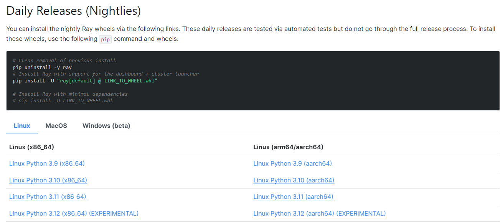

安装完后使用命令`python3 --version`查看是否安装成功
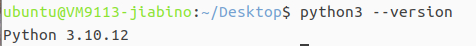

3. `sudo apt install python3-pip` 安装python的包管理工具，用于安装和管理python包
   
4. `pip install -U "ray[default]"` 安装ray的默认版本(`-U` 参数告诉 pip 安装时要升级已经安装的包到最新版本`[default]`参数用于安装Ray包时的同时同时安装默认的附加依赖包)
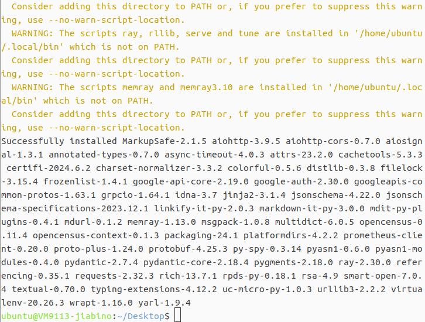

5. `pip show ray` 显示其安装路径
 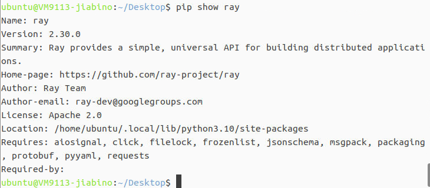
 但此时使用`ray --version`查看ray时它会找不到命令：
 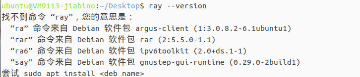
这是由于ray的安装位置没有被添加到环境变量里，导致命令行在寻找命令时不会到ray的安装位置寻找，这时需要将ray的安装位置添加到环境变量中并进行保存。
在添加环境变量前先执行命令`ls /home/ubuntu/.local/bin/`检查是否存在`ray`文件：
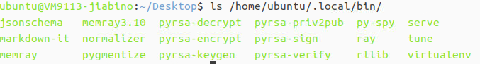
这里是存在的，然后执行`echo 'PATH=$PATH:/home/ubuntu/.local/bin' >> ~/.bashrc`以及`source ~/.bashrc`，将ray的安装路径加入到环境变量中并保存，注意这里的`ubuntu`要替换成实际的虚拟机用户名。执行完后应该就能查看ray的版本信息了。
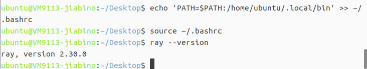

### 二、ray的使用及可视化
使用以下命令进行头结点的创建：
`ray start --head --port=6379 --include-dashboard=true --dashboard-host=0.0.0.0 --dashboard-port=8265`
创建好后会出现以下信息：
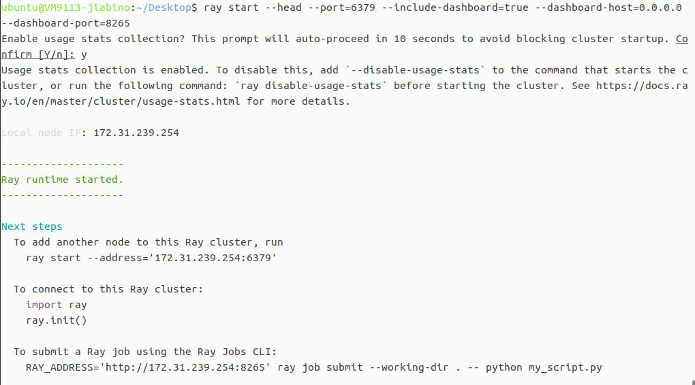
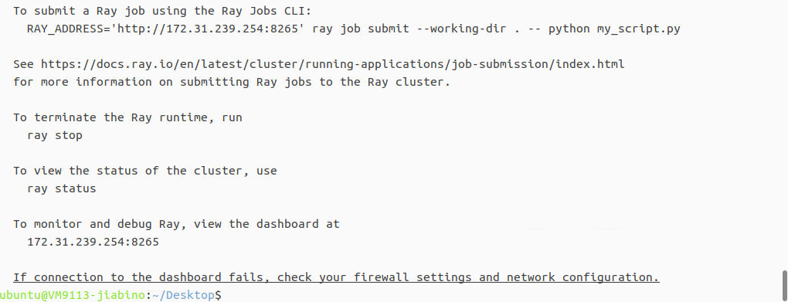
头结点创建后，在虚拟机本地打开浏览器并输入网址`172.31.23.254:8265`进行ray集群的可视化功能体验：
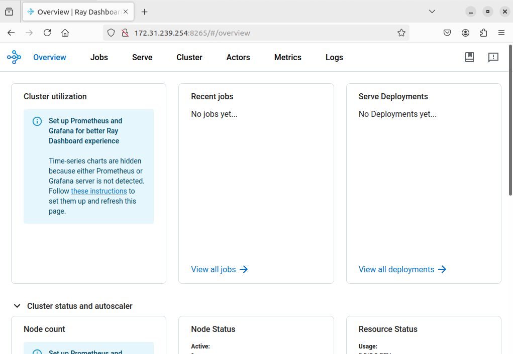
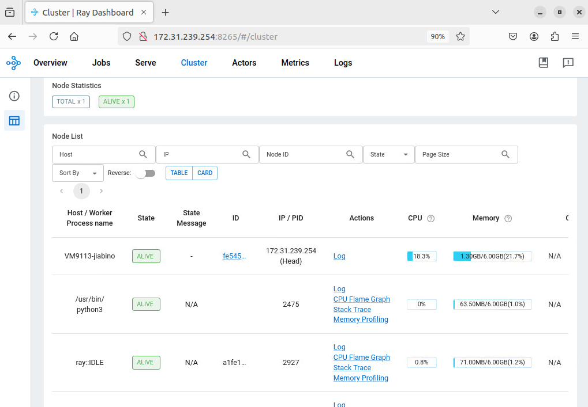
在这个网络端口可以查看所有头结点管理的节点及自身的实时工作状态。

### 三、ray部署后的测试
我们这里定义了一个简单的任务分发的函数进行测试，测试的源代码如下：
```py
import ray

# 初始化 Ray 集群
ray.init(address='auto')

@ray.remote
def simple_task(x):
    return x * x

# 分发任务到集群上
futures = [simple_task.remote(i) for i in range(10)]

# 收集结果
results = ray.get(futures)

# 打印结果
print("Task results:", results)

# 关闭 Ray
ray.shutdown()

```
测试的结果为：
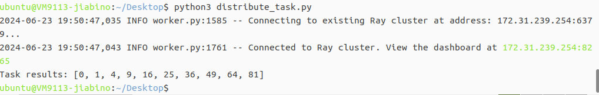
可以看到部署在虚拟机上的ray节点能够正常的连接并进行工作了。
