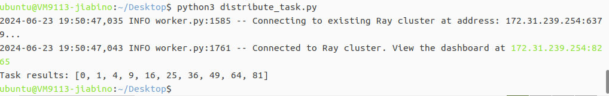
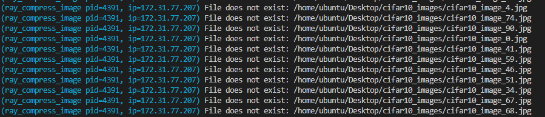
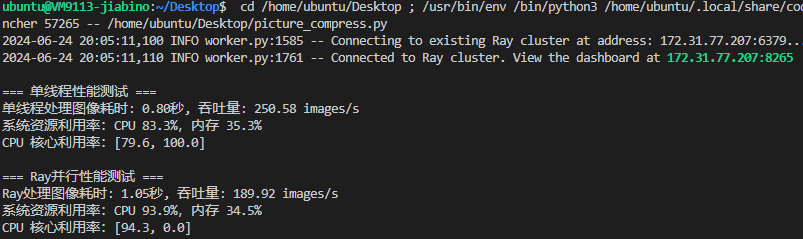
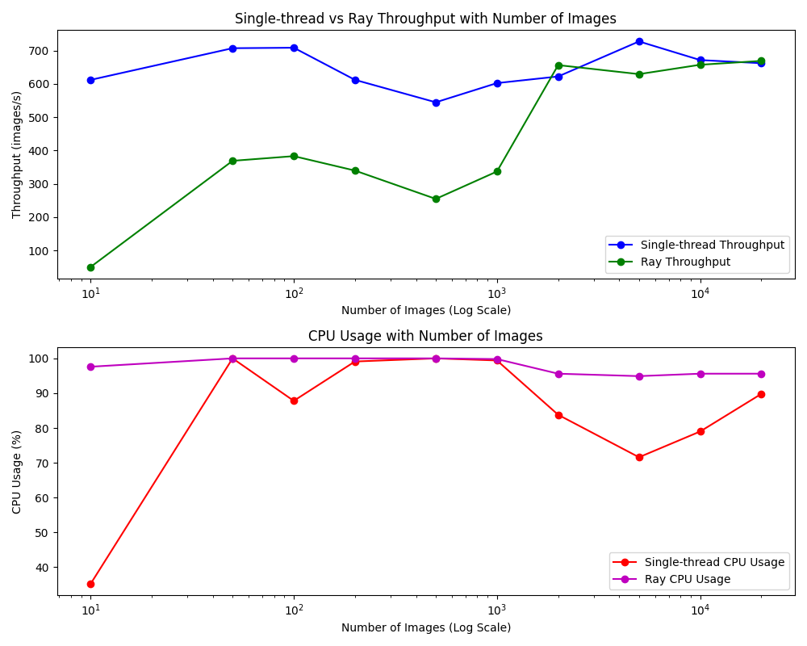
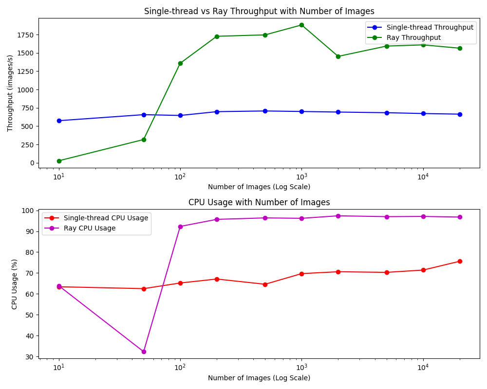

# Lab4说明文档
## 单机版部署ray
### 一、配置环境：
配置环境的步骤如下：
1. `sudo apt update` 更新软件包；

2. `sudo apt install python3.10` (或者替换其他ray能够支持的python版本)；
```
tips: 查看ray适配的python版本可以到https://docs.ray.io/en/latest/ray-overview/installation.html 上查找相关信息
```


安装完后使用命令`python3 --version`查看是否安装成功


3. `sudo apt install python3-pip` 安装python的包管理工具，用于安装和管理python包

4. `pip install -U "ray[default]"` 安装ray的默认版本(`-U` 参数告诉 pip 安装时要升级已经安装的包到最新版本`[default]`参数用于安装Ray包时的同时同时安装默认的附加依赖包)
   


5. `pip show ray` 显示其安装路径
   


但此时使用`ray --version`查看ray时它会找不到命令：


这是由于ray的安装位置没有被添加到环境变量里，导致命令行在寻找命令时不会到ray的安装位置寻找，这时需要将ray的安装位置添加到环境变量中并进行保存。
在添加环境变量前先执行命令`ls /home/ubuntu/.local/bin/`检查是否存在`ray`文件：


这里是存在的，然后执行`echo 'PATH=$PATH:/home/ubuntu/.local/bin' >> ~/.bashrc`以及`source ~/.bashrc`，将ray的安装路径加入到环境变量中并保存，注意这里的`ubuntu`要替换成实际的虚拟机用户名。执行完后应该就能查看ray的版本信息了。


### 二、ray的使用及可视化
使用以下命令进行头结点的创建：
`ray start --head --port=6379 --include-dashboard=true --dashboard-host=0.0.0.0 --dashboard-port=8265`
创建好后会出现以下信息：


头结点创建后，在虚拟机本地打开浏览器并输入网址`172.31.23.254:8265`进行ray集群的可视化功能体验：


在这个网络端口可以查看所有头结点管理的节点及自身的实时工作状态。

### 三、ray部署后的测试
我们这里定义了一个简单的任务分发的函数进行测试，测试的源代码如下：
```py
import ray

# 初始化 Ray 集群
ray.init(address='auto')

@ray.remote
def simple_task(x):
    return x * x

# 分发任务到集群上
futures = [simple_task.remote(i) for i in range(10)]

# 收集结果
results = ray.get(futures)

# 打印结果
print("Task results:", results)

# 关闭 Ray
ray.shutdown()

```
测试的结果为：


可以看到部署在虚拟机上的ray节点能够正常的连接并进行工作了。

    
## 二、性能指标列表
经过小组讨论，我们选择了以下指标对ray计算进行性能的评估：
| 指标名称               | 意义                                       | 单位                         |
|----------------------|------------------------------------------|----------------------------|
| 吞吐量 (Throughput)  | 单位时间内系统处理的任务数量。               | 任务数/秒 (tasks/second)、请求数/秒 (requests/second) |
| 资源利用率 (Resource Utilization) | 监测系统的CPU、内存、磁盘和网络带宽使用情况，确保资源有效利用。 | 百分比 (%)，例如CPU利用率 70% |
| 任务调度时间 (Task Scheduling Time) | 任务从提交到被调度和分配到执行节点上的时间。     | 毫秒 (ms)、秒 (s)             |
| 延迟 (Latency)        | 每个任务或请求从开始到完成所需的时间。           | 毫秒 (ms)、秒 (s)             |
| 任务失败率 (Task Failure Rate) | 任务执行失败的比例。                        | 百分比 (%)                   |
| 工作负载分布 (Workload Distribution) | 监控任务在集群中各节点上的分布情况，确保负载均衡。 | 无                           |

其中，我们小组最终对吞吐量、资源利用率进行了测量，以下是对指标选择的合理性和意义的分析：

- **吞吐量** (Throughput)
    - 意义：
        - 吞吐量反映了系统在单位时间内能处理的任务或请求的数量，这是衡量系统性能的核心指标之一。
        - 对于并行计算框架，如Ray，吞吐量是衡量其处理能力和效率的直接反映。
    - 合理性：  
        - 高吞吐量表明系统在处理大量任务时的能力强，这直接关系到系统在实际应用中的表现。
        - 通过测量吞吐量，可以识别出系统在高负载情况下的瓶颈，从而指导优化和改进。
  
- **资源利用率 (Resource Utilization)**
    - 意义：
        - 资源利用率指的是系统在运行时对CPU、内存、磁盘和网络带宽等资源的使用情况。
        - 高效的资源利用率意味着系统能够充分利用可用资源，从而提高整体性能和成本效益。
    - 合理性：

        - 资源利用率可以帮助识别资源是否存在浪费或者不足，从而优化资源分配。
        - 对于并行计算框架，特别是涉及多节点的集群系统，确保各节点资源的高效利用对整体性能至关重要。
        - 监控资源利用率还可以防止系统过载，确保稳定性和可靠性。

总结：选择吞吐量和资源利用率作为评估Ray计算性能的指标具有很高的合理性。这些指标全面反映了系统的处理能力和资源利用效率，为系统性能优化提供了重要依据。这些指标的测量和分析可以帮助识别和解决性能瓶颈，提高系统的整体效率和稳定性。

## 三、单机版性能指标测试
### 计算任务说明
我们小组将计算任务设定为***对定量图片的压缩***。将计算任务设定为对定量图片的压缩是一种合理且有效的选择，因为图像压缩任务能够全面反映系统的吞吐量、资源利用率。下面是从测量选定性能指标的角度对这种设定合理性的说明：

1. **吞吐量（Throughput）**
- 意义：吞吐量是指单位时间内系统处理的任务数量。对于图像压缩任务，可以直接衡量每秒压缩的图片数量。

- 合理性：
    - 可测量性：图像压缩任务有明确的起点和终点，可以精确测量每秒处理的图片数量。
    - 高频率操作：图像压缩通常是快速完成的任务，能够提供足够的操作频率来计算系统吞吐量。
    - 量化对比：通过比较Ray并行处理和单线程处理的每秒压缩图片数量，可以清晰地对比系统在不同处理方式下的吞吐量差异。
2. **资源利用率（Resource Utilization）**
- 意义：资源利用率是指系统的CPU、内存、磁盘和网络带宽使用情况，确保资源得到有效利用。

- 合理性：
    - 高CPU利用率：图像压缩是一个计算密集型任务，能够充分利用CPU资源。通过监控CPU利用率，可以评估系统在处理任务时的资源使用效率。
    - 内存占用：图像处理需要一定的内存空间，监控内存利用率可以帮助评估任务对内存的需求。
    - 磁盘I/O：图像的读取和写入操作涉及磁盘I/O，通过监控磁盘使用情况，可以评估I/O性能和瓶颈。
    - 网络带宽（如果涉及分布式系统）：在分布式环境中，任务调度和数据传输会消耗网络带宽，通过监控网络利用率可以评估系统的网络性能。

综上所述，将计算任务设定为对定量图片的压缩，不仅能够提供明确的、可测量的性能指标，还能全面反映系统在不同维度的表现。这些特点使得图像压缩任务成为评估吞吐量、资源利用率和工作负载分布的理想选择，有助于全面了解和优化系统性能。

### 性能指标测量过程
#### 一、图片数据集的获取
被压缩的图片来源于`python`库`torchvision`中的`CIFAR-10`数据集，里面包含了60000张32*32像素的彩色图像，分为10类图片。
执行以下代码以下载图片数据集中的部分图片：
```py
# num_images_list是测试数量列表，定义在前面的代码
for num_images in num_images_list:
        # 设置保存图像的目录为当前工作目录下的 cifar10_images 文件夹
        save_dir = os.path.join(os.getcwd(), 'cifar10_images')

        # 如果目录存在，则清空其中的所有文件
        if os.path.exists(save_dir):
            file_list = glob(os.path.join(save_dir, '*.jpg'))
            for file_path in file_list:
                os.remove(file_path)
        else:
            os.makedirs(save_dir)  # 如果目录不存在，则创建目录

        # 保存图像
        save_images(cifar10, save_dir, num_images)
        print(f"保存了 {num_images} 张图像")
```

#### 二、具体性能测试的设计
针对图片数据在ray上的传输，一开始我们尝试让远程的ray节点通过文件存储的绝对路径来读取图片数据。



在尝试失败后，我们了解到为什么ray无法读取本地的图片数据，原因如下：
```
Ray 是设计用来支持分布式计算的系统，它的目标是能够在多个计算节点上并行执行任务。
在这样的环境中，各个计算节点之间可能没有共享的文件系统。
或者即使有共享文件系统，也不是直接通过本地路径进行访问的。
因此，Ray 的远程任务在执行时默认情况下不能访问本地节点的文件系统。
```
后来我们采取的解决方案是传输文件数据而非路径： 使用类似 `open(file_path, 'rb').read()`这样的方法，读取文件的二进制数据，并使用 `ray.put()` 将数据传输到远程任务中。这样可以避免传输路径，而是传输文件的实际内容。

我们具体的性能测试程序如下：
```py
# 获取图像路径
image_paths = glob(os.path.join(save_dir, '*.jpg'))

# 测量单线程性能
_, single_thread_throughput, single_thread_cpu_usage, _ = measure_performance(image_paths, os.path.join(save_dir, 'single_thread_image_{}.jpg'), use_ray=False)
single_thread_throughputs.append(single_thread_throughput)
single_thread_cpu_usages.append(single_thread_cpu_usage)

# 测量 Ray 并行性能
_, ray_throughput, ray_cpu_usage, _ = measure_performance(image_paths, os.path.join(save_dir, 'ray_image_{}.jpg'), use_ray=True)
ray_throughputs.append(ray_throughput)
ray_cpu_usages.append(ray_cpu_usage)

# 清理测试生成的压缩图像文件
for i in range(num_images):
    single_file = os.path.join(save_dir, f"single_thread_image_{i}.jpg")
    ray_file = os.path.join(save_dir, f"ray_image_{i}.jpg")
    if os.path.exists(single_file):
        os.remove(single_file)
    if os.path.exists(ray_file):
        os.remove(ray_file)
```

在图片数为100时，性能的测试如下：

图片数为200时，性能测试如下：

当处理较少数量的图片时（比如一百张），单线程的处理速度通常会比较快。这是因为单线程不需要额外的**任务调度和数据传输开销**，操作系统可以更加高效地处理单个任务。此时，图片处理过程中的瓶颈可能主要是在于CPU的计算能力和磁盘IO速度。

然而，当处理的图片数量增多（比如几百张甚至几千张），单线程的处理速度可能会显著减慢。这时候，Ray 的并行处理优势就显现出来了。Ray 可以将大量的图片处理任务分发到多个工作进程或者多个计算节点上并行执行。每个任务可以在独立的计算单元上运行，相互之间不会阻塞，从而可以更快速地完成整体任务。特别是在多核处理器或者分布式计算环境下，Ray 的并行能力能够更好地利用系统资源，进一步提升处理效率。

我们在多个图片数量上进行了测试，绘制出来的图表如下：

其使用的init默认参数为：
```
默认num_cpus: 2.0
默认num_gpus: 0
默认内存大小: 2487690855.0
默认对象存储内存大小: 1243845427.0
```

#### 三、ray的参数设置及性能变化    
将参数设置修改为：
```
默认num_cpus: 8.0
默认num_gpus: 0
默认内存大小: 13566846978.0
默认对象存储内存大小: 6058836786.0
```
后，绘制出来的图表如下：

参数变化导致吞吐量提升超过20%以上，以下是参数可能影响性能的原因：

1. **并行处理能力提升**：
当num_cpus 参数从 2 提升到 8 时，意味着 Ray 可以同时在更多的 CPU 核心上并行执行任务。在处理多个图像压缩任务时，每个 CPU 核心可以处理一个任务，因此增加了整体的并行处理能力。这导致了任务完成的速度更快，从而显著提高了整体的吞吐量。

2. **内存和对象存储优化**：
配置参数中的 内存大小 和 对象存储内存大小 的提升意味着系统可以处理更大规模的数据和更多的中间状态。在处理大量图像时，可能需要大量的内存来存储图像数据和处理中间结果。通过增加内存和对象存储内存的配置，避免了因内存不足导致的性能瓶颈，确保了系统可以高效地处理更多的任务和数据。

3. **资源利用率优化**：
提升配置参数后，系统资源的利用率也可能得到了优化。在默认配置下，可能由于资源限制或者配置不足，导致系统资源的利用率不高。例如，CPU 利用率可能未达到最大值，内存使用可能受限制。通过提升配置参数，系统更能够充分利用现有资源，从而提高了整体的效率和性能。

4. **任务调度和管理优化**：
Ray 提供了高效的任务调度和管理机制，可以根据配置的资源情况进行智能调度。提升配置参数后，Ray 可以更好地管理和调度任务，确保任务能够按时完成并充分利用资源。这种优化对于大规模数据处理和并行计算特别重要，可以显著提升系统的整体性能。
