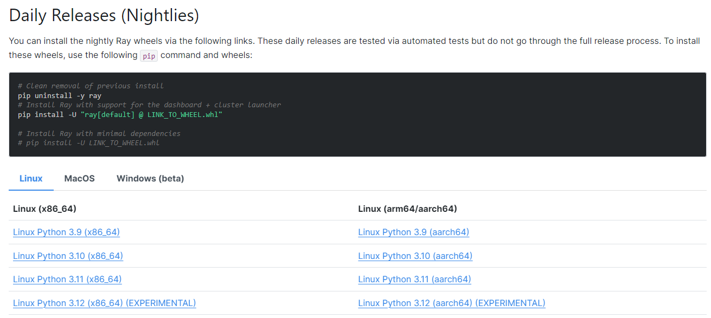
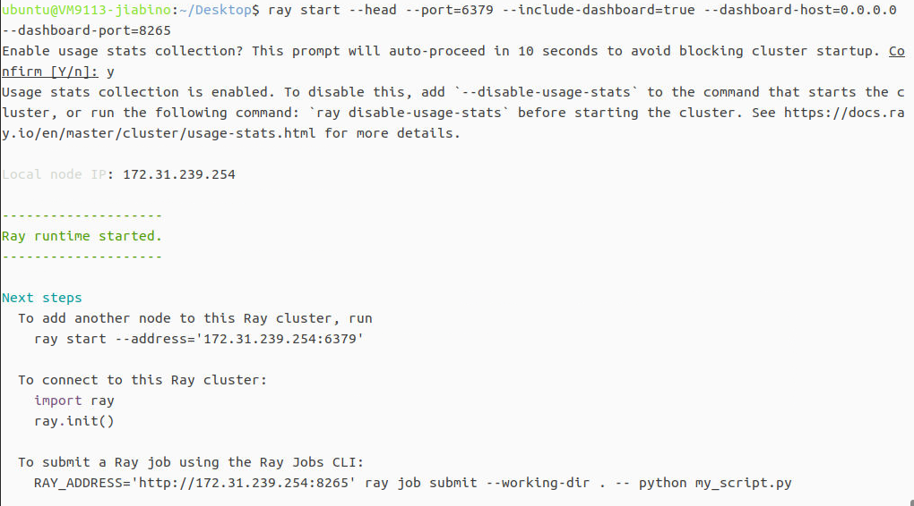
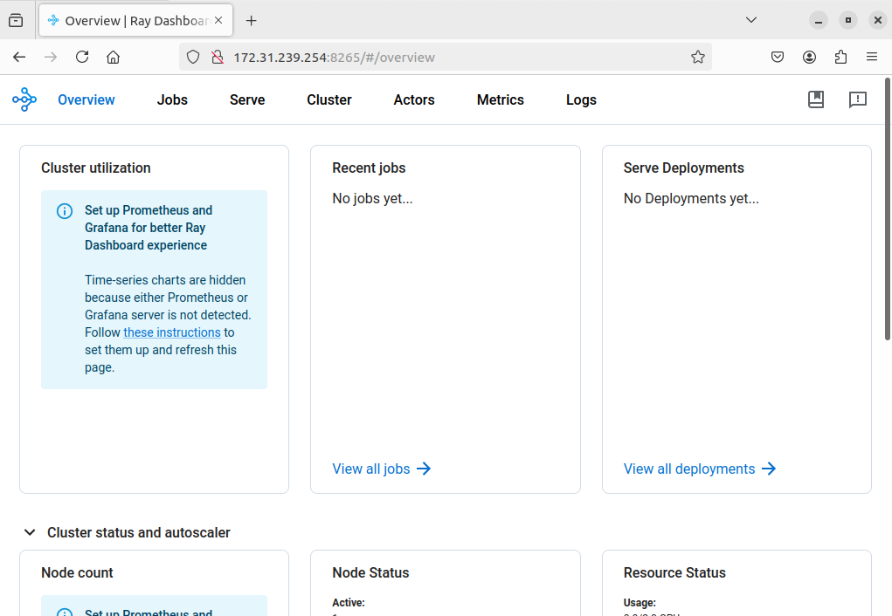

# Lab4说明文档
## 实验说明
Ray 是伯克利大学 RISELab 研发的分布式计算系统，它主要有以下的特点：

1. 提供一种能够构建、运行分布式应用程序的 simple primitives；
2. 从单机扩展到平行，几乎不需要改代码；
3. 拥有良好的生态，能够在 core Ray 上构建复杂的应用程序。

本次实验实验环境为ustc的vlab虚拟机，步骤为进行ray的单机部署、多机部署以及性能测试等工作。

## 单机版部署ray
### 一、配置环境：

配置环境的步骤如下：

1. `sudo apt update` 更新软件包；

2. `sudo apt install python3.10` (或者替换其他ray能够支持的python版本)；
```
tips: 查看ray适配的python版本可以到https://docs.ray.io/en/latest/ray-overview/installation.html 上查找相关信息
```


安装完后使用命令`python3 --version`查看是否安装成功


3. `sudo apt install python3-pip` 安装python的包管理工具，用于安装和管理python包

4. `pip install -U "ray[default]"` 安装ray的默认版本(`-U` 参数告诉 pip 安装时要升级已经安装的包到最新版本`[default]`参数用于安装Ray包时的同时同时安装默认的附加依赖包)
   


5. `pip show ray` 显示其安装路径
   


但此时使用`ray --version`查看ray时它会找不到命令：


这是由于ray的安装位置没有被添加到环境变量里，导致命令行在寻找命令时不会到ray的安装位置寻找，这时需要将ray的安装位置添加到环境变量中并进行保存。
在添加环境变量前先执行命令`ls /home/ubuntu/.local/bin/`检查是否存在`ray`文件：


这里是存在的，然后执行`echo 'PATH=$PATH:/home/ubuntu/.local/bin' >> ~/.bashrc`以及`source ~/.bashrc`，将ray的安装路径加入到环境变量中并保存，注意这里的`ubuntu`要替换成实际的虚拟机用户名。执行完后应该就能查看ray的版本信息了。


### 二、ray的使用及可视化

使用以下命令进行头结点的创建：
`ray start --head --port=6379 --include-dashboard=true --dashboard-host=0.0.0.0 --dashboard-port=8265`
创建好后会出现以下信息：




头结点创建后，在虚拟机本地打开浏览器并输入网址`172.31.23.254:8265`进行ray集群的可视化功能体验：




在这个网络端口可以查看所有头结点管理的节点及自身的实时工作状态。

## 分布式ray集群部署

1. 通过以下命令创建ray头结点
```
ray start --head --port=6379 --include-dashboard=true --dashboard-host=0.0.0.0 --dashboard-port=8265
```
2. 在其他主机中连接该头结点
```
ray start --address='172.31.77.207:6379'
```
3. 查看头结点状态，发现连接成功
   


4. 分布式ray部署完成